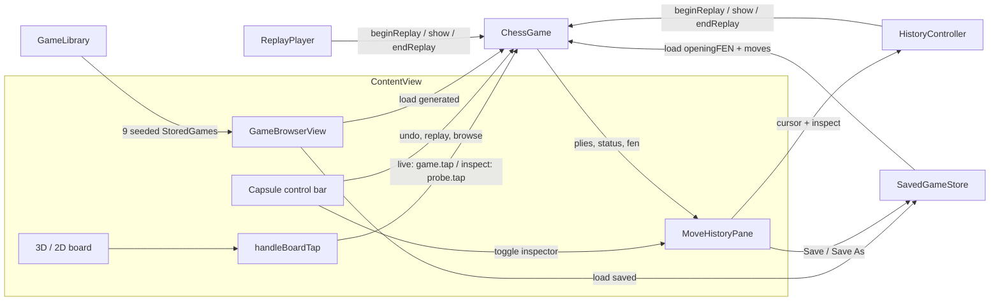
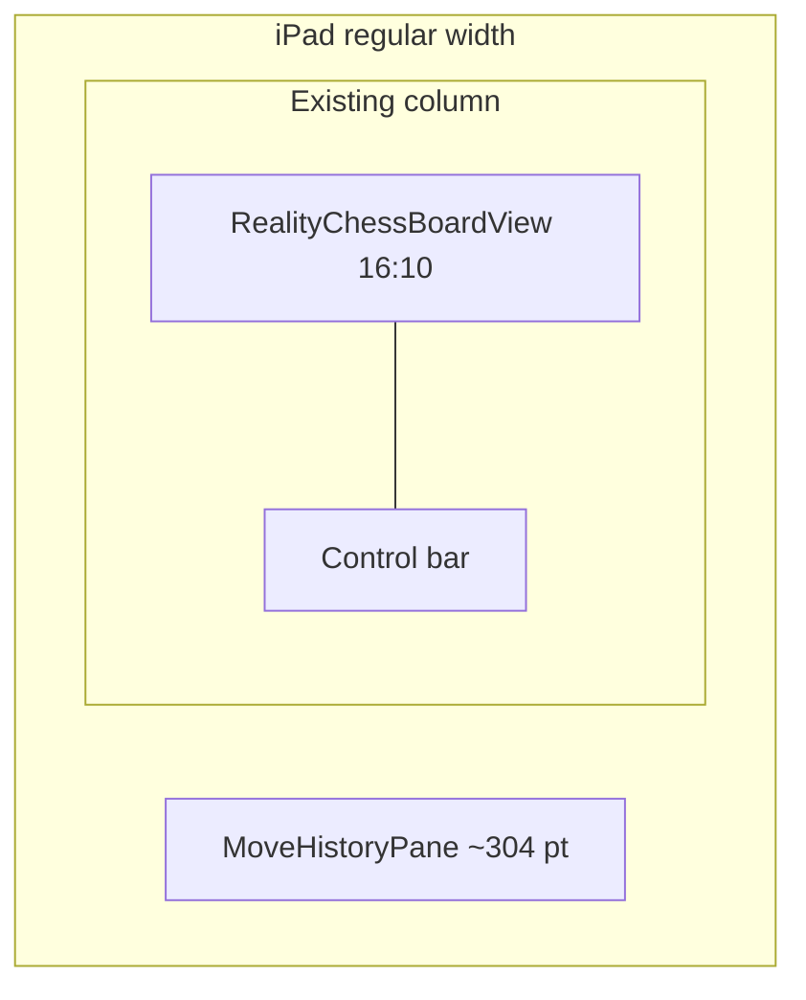
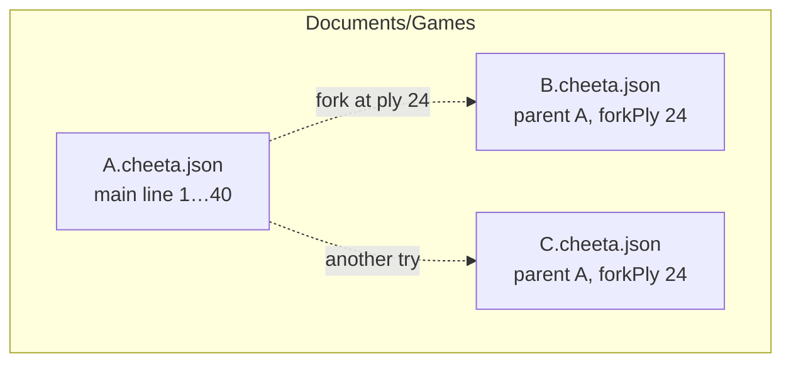
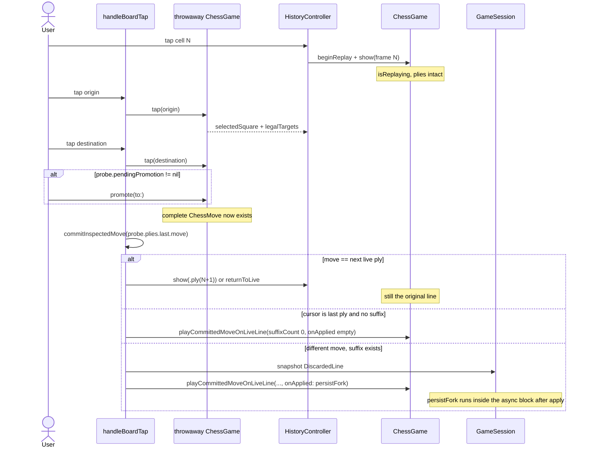

# Move History Pane, Persistence, and Forking

| Field | Value |
| --- | --- |
| Author | TBD |
| Date | 2026-08-14 |
| Status | Accepted (product decisions locked 2026-08-14) |
| Audience | CheeTA engineers |
| Scope | Tabular ply browser for the live game; local save/load of user games; fork-on-write from a viewed ply |

This is an accepted design, not an implementation. Product questions in Resolved Questions are locked. It is written against CheeTA as it exists on 2026-08-14: SwiftUI + RealityKit, iPadOS 18+, `ChessGame` as the live engine, `StoredGame` / `GameLibrary` as an in-memory generated shelf, and no persistence of user-played games.

---

## Overview

CheeTA already records every played half-move as a `RecordedPly` on `ChessGame.plies` and can park the live board to show a stored frame (`beginReplay()` / `show(_:)` / `endReplay()`). What it does not have is a way to *browse* that history, persist a user-played game, or branch from an earlier ply without destroying the original line. Undo today calls `plies.removeLast` and rebuilds rule state from the remaining sequence — a destructive rewrite of a single line.

This document proposes three stacked capabilities, designed so each can ship as its own PR:

1. **A trailing inspector pane** that renders `game.plies` as a move table (move number, White, Black, annotations). Tapping a cell *inspects* that position by borrowing the published board the same way replay already does. Inspection is not undo and is not autoplay.
2. **A local document store** for user-played games. The on-disk form is a CheeTA-native JSON document of opening FEN + `[ChessMove]`. Load continues to reconstruct `RecordedPly`s by replaying through the engine, which is what `ChessGame.load(_ stored:)` already does.
3. **Fork-on-write.** Viewing ply *N* and then completing a *different legal move* (including promotion) snapshots the discarded suffix, truncates the current line to *N*, and continues. Selection and legal-move highlighting happen on a throwaway `ChessGame`; the live `plies` array is not touched until that move is complete. The original saved document is never rewritten. The engine stays linear; the tree lives in documents and a small session object, not in `ChessGame`.

The generated `GameLibrary` shelf and `GameBrowserView` remain a gallery of *complete* games. The history pane is a browser of the *current* game. They meet only at load/save.

---

## Background & Motivation

### Current state

`ChessGame` (`CheeTA/ChessGame.swift`) is the source of legal play. It publishes:

- `plies: [RecordedPly]` — every half-move since the position was set up, oldest first.
- `isReplaying` — when true, the published `board` / `currentPlayer` / `lastMove` are a parked frame; `tap(_:)` is a no-op.
- Opening rule state, kept private: `openingBoard`, `openingPlayer`, `openingCastlingRights`, `openingEnPassantTarget`, `openingHalfmoveClock`, `openingFullmoveNumber`. Undo and replay reconstruct from this baseline plus the retained sequence (`restoreStateFromHistory()`).

A `RecordedPly` (`CheeTA/ChessTypes.swift`) already carries everything a table cell and a scrubber need:

```swift
struct RecordedPly: Hashable, Sendable {
    let move: ChessMove          // from / to / promotion / isEnPassant
    let capture: Capture?
    let boardAfter: [Square: Piece]
    let playerToMoveAfter: Player
    let statusAfter: PositionStatus
}
```

Replay never re-derives legality. `replayFrames(lastPlies:)` emits an opening `ReplayFrame` plus one frame per ply; `ReplayPlayer` (`CheeTA/ReplayControls.swift`) autoplays those frames and interleaves `CutSceneEvent`s. There is no scrubber and no click-to-ply.

`StoredGame` (`CheeTA/GameLibrary.swift`) is the load shape today: `id: Int`, `name`, `moves: [ChessMove]`, `finalBoard`, `result`, `captureCount`, `queenTaken`, `endedWithoutMatingMaterial`. `ChessGame.load(_ stored:)` `reset()`s and then calls private `completeMove` for each stored move. Tests in `testLoadingAStoredGameRestoresItsFullHistory` pin this: after load, `game.plies.map(\.move) == stored.moves` and `replayFrames().count == stored.moves.count + 1`.

`GameLibrary` only generates a deterministic in-memory shelf of 9 random games. There is no `Codable` anywhere in the project, no `FileManager` use, no SwiftData, no UserDefaults-backed game list.

`ContentView` is a single centered column: 3D (or 2D) board, then a capsule control bar. The game browser is a *sheet* that covers the board. FEN transfer (`FENTransferSheet`) copies or loads a **position**; `load(fen:)` explicitly empties `plies`. There is no size-class split, no inspector, no SAN/PGN layer.

Undo is a control-bar menu: 1 ply or 2 plies. Both truncate. Playing after undo continues from the new tip. There is no tree, no variation, no cursor.

### Pain points

- After move 20 the only way to see move 8 is to undo 12 times (destroying 12–20) or to start a full replay and wait.
- A finished generated game can be reloaded and replayed, but a game the user just played exists only in RAM. Force-quit loses it.
- “I want to try something else from move 12” is currently “undo to 12 and lose the original finish.”
- FEN can start a game from a non-standard position, but `StoredGame` has no opening FEN. `load(_ stored:)` always `reset()`s to the standard start. User persistence cannot be built on `StoredGame` as it stands if we also want to save FEN- or preset-started games.

### Why now

The engine already has the data (`RecordedPly`) and a *live-tip park* (`beginReplay`/`show`/`endReplay`). That park is necessary but not sufficient: `show(_:)` does not publish `status`, so inspect still needs a display-safety change (see §1), and a viewed position is not a legal-play state (see §5). The pane is a presentation problem plus a small session object. Persistence is a new isolated store. Forking is a two-phase caller protocol on top of the existing truncate primitive, not a new move generator.

---

## Goals & Non-Goals

### Goals

- Show the current game’s plies as a native iPad table that can sit beside the 3D board.
- Let the user inspect any earlier position without losing the live tip.
- Make inspect, undo, and autoplay-replay three distinct operations, visible in the UI and in the engine API.
- Persist user-played games locally, including games that did not start from the standard opening.
- Load a saved game into a replayable `plies` array (same contract as `load(_ stored:)`).
- When the user is looking at ply *N* and plays a different move, create a fork rather than silently rewrite the original saved game.
- Keep `ChessGame` the only place that decides legality.
- Ship incrementally: pane → save/load → fork.

### Non-Goals (v1–v3 of this work)

- ChessBase-style interactive trees, NAG annotations, clocks, or engine analysis.
- SAN/PGN as the *source of truth*. Coordinate notation is enough to label cells; PGN export is a later optional encoder.
- iCloud, accounts, or a server. Local Documents is enough. iCloud Drive / ubiquity is called out as a later option, not designed here.
- Replacing `GameLibrary`’s generated shelf, or making generated games persist.
- Changing 3D/2D rendering, cut-scene art, or the uncommitted visual work in `PieceGalleryView` / `RealityChessBoardView` / `ChessPieceMeshes`.
- Networked or engine-vs-player clocks. Undo remains a local two-player primitive.
- Teaching the history pane to invent or edit moves.

---

## Proposed Design

### Design thesis

Keep three objects with the same separation CheeTA already uses for replay:

| Object | Owns | Must not own |
| --- | --- | --- |
| `ChessGame` | Legal position, `plies` (the **current line**), parked live state | Viewing cursor, file identity, variation tree |
| `HistoryController` | Viewing cursor, inspect/return-to-live | Move generation, disk |
| `SavedGameStore` | JSON documents on disk, library list | Board display, legality |
| `ReplayPlayer` | Autoplay timeline + cut-scene beats | Cursor, persistence |
| `GameLibrary` | Deterministic generated shelf | User documents |

`ContentView` is the arbiter when two clients want the borrowed board (inspect vs. autoplay).



### 1. Viewing cursor (source of truth)

**The table is not the source of truth for the game. `ChessGame.plies` is the current line. `HistoryController.cursor` is the source of truth for “which position is on the board right now.”**

```swift
enum HistoryCursor: Equatable {
    /// Published board is the live tip. Taps play. This is the default.
    case live
    /// Board shows the opening snapshot (before ply 0).
    case opening
    /// Board shows `game.plies[index].boardAfter`. `index` is in `game.plies.indices`.
    case ply(Int)
}
```

Putting the cursor on `ChessGame` would mix presentation with rules. The engine already has one borrowed-board mode (`isReplaying`) and it exists only because the published `board` has to change and `tap` has to be inert. Inspection reuses that *park* so the live tip is not lost; it does not add `viewedPlyIndex` to the engine. The park is not a complete display borrow until `status` is parked too (next subsection).

Invariants:

- `history.isInspecting` (`cursor` is `.opening` or `.ply`) and `replay.isPlaying` are mutually exclusive. At most one client owns `game.isReplaying`.
- `cursor == .live` whenever `!history.isInspecting`. Autoplay runs only from `.live`. `finish` / `stop` of a replay leave `cursor == .live`.
- `cursor != .live` ⇒ `game.isReplaying == true` (inspect owns the park). The converse is false: `isReplaying` is also true during autoplay, when `cursor == .live`.
- Inspection never mutates `plies`.
- `pendingPromotion != nil` blocks inspection (same guard as `beginReplay()`).
- A new live ply while `cursor == .live` keeps the cursor at `.live` and the table scrolls to the new tip.
- Every engine replacement (`reset`, `load(_ stored:)`, `load(fen:)`, `load(_ preset:)`, `load(openingFEN:moves:)`) goes through `ContentView.replaceGame` (§3), which calls `history.returnToLive` before mutating.
- Undo from the control bar always undoes the **live tip**, never the viewed ply. PR 2 leaves the undo menu disabled while `isReplaying` (today’s `canUndoTurn`). PR 4 rewires it: return to live, then undo the tip (see §5).

#### Three operations that must not collapse

| Operation | Mutates `plies`? | Parks live board? | Autoplay? | Board taps |
| --- | --- | --- | --- | --- |
| **Inspect** (tap a cell) | No | Yes (`beginReplay` + `show`) | No | PR 2: ignored (`isReplaying`). PR 4: selection against a throwaway engine; live `plies` unchanged until a completed legal move |
| **Undo** (control-bar menu) | Yes, `removeLast` | No | No | Live, from the new tip |
| **Replay** (`ReplayPlayer.play`) | No | Yes | Yes, timed + cut scenes | Ignored. `handleBoardTap` stops playback and **returns**; it does not `tap`. The badge is the explicit stop. |

The pane labels these explicitly. The inspected row is marked “Viewing”; the live tip is marked “Now”. Undo stays in the existing orange menu and is **not** offered as a row swipe in v1 (a swipe-to-undo would be indistinguishable from inspect).

#### How inspect uses the existing park — and what must change

`ReplayPlayer` already demonstrates the *park*: `beginReplay()` copies live rule state into private `LiveState`, `show(_:)` writes a subset of published fields, `endReplay()` puts them back. `tap` bails on `isReplaying`. `canUndoTurn` is false while replaying. `testReplayParksTheLiveGameAndRestoresIt` pins taps inert and board restore.

That is **not** a complete display borrow. `show(_:)` today writes only `board`, `currentPlayer`, and `lastMove`. Live `status`, `captureCount`, `lastCapture`, `lastEnPassant`, and `lastEnPassantOpportunity` stay published.

`isKingInCheck(at:)` (`ChessGame.swift`) keys off live `status` plus the *shown* `board` / `currentPlayer`:

```swift
func isKingInCheck(at square: Square) -> Bool {
    guard case .check(let player) = status,
          board[square] == Piece(kind: .king, player: player) else {
        if case .checkmate = status,
           let piece = board[square],
           piece.kind == .king,
           piece.player == currentPlayer {
            return true
        }
        return false
    }
    return true
}
```

Both `RealityChessBoardView` and `ChessBoardView` call this. After a checkmate, inspecting an earlier ply still takes the `.checkmate` branch and can highlight the wrong king on the inspected board. `statusText` likewise stays “Checkmate — White wins” while the pane would claim a side to move.

**Chosen fix (PR 2, engine):** park and restore `status`. Add `status: PositionStatus` to `ReplayFrame` and to `LiveState`. `beginReplay()` copies `status` into `LiveState`. `show(_:)` publishes `frame.status`. `endReplay()` restores parked `status`. Do **not** write `status` from `show` without parking it — `endReplay()` would leave the live game on the inspected verdict.

`replayFrames(lastPlies:)` fills the new field:

- Opening frame of a full-game replay (`start == 0`): evaluate the opening position with the same rules as `refreshStatus()` (extract a `static func positionStatus(board:player:castlingRights:enPassantTarget:)` and have `refreshStatus()` call it). Do not store a parallel `openingStatus` field.
- Frame for ply `i`: `plies[i].statusAfter`.
- Frame 0 of a clipped replay (`start > 0`): `plies[start - 1].statusAfter`.

Writing `status` from `show` *will* fire `ContentView`’s `onChange(of: game.status)`. Inspect and autoplay must therefore hold `suppressCutSceneTriggers == true` for the whole borrow (not only the transition). `ReplayPlayer.finish` / `HistoryController.returnToLive` clear it on the next run-loop turn, matching today’s undo pattern. Do not add `lastMove`-based scene triggers.

Cut-scene publishers (`captureCount`, `lastEnPassant*`) still stay at the live tip during inspect. That is correct: we are not replaying those events, and `suppressCutSceneTriggers` is belt-and-braces if that ever changes.

`HistoryController` is a second client of the same three methods, not a new engine mode:

```swift
@MainActor
final class HistoryController: ObservableObject {
    @Published private(set) var cursor: HistoryCursor = .live
    /// Selection overlay while inspecting (PR 4). Live play still uses
    /// `game.selectedSquare` / `game.legalTargets`.
    @Published var selectedSquare: Square?
    @Published var legalTargets: Set<Square> = []
    /// Mirrored from the held probe. `@State inspectProbe` will not
    /// refresh `PromotionPicker`; this will.
    @Published var pendingPromotion: PendingPromotion?

    var isInspecting: Bool {
        if case .live = cursor { return false }
        return true
    }

    func show(_ target: HistoryCursor, in game: ChessGame) {
        // Caller (ContentView) must have stopped ReplayPlayer if it
        // was playing. This method must not call replay.stop.
        switch target {
        case .live:
            returnToLive(in: game)
        case .opening, .ply:
            guard game.pendingPromotion == nil else { return }
            if !game.isReplaying { game.beginReplay() }
            game.show(frame(for: target, in: game))
            cursor = target
        }
    }

    func returnToLive(in game: ChessGame) {
        if game.isReplaying { game.endReplay() }
        cursor = .live
        selectedSquare = nil
        legalTargets = []
        pendingPromotion = nil
    }
}
```

`frame(for:in:)` is a pure mapping onto existing types (PR 2 adds `status`):

- `.opening` → `ReplayFrame(board: openingBoard, move: nil, playerToMove: openingPlayer, status: ChessGame.positionStatus(...opening fields...))`
- `.ply(i)` → `ReplayFrame(board: plies[i].boardAfter, move: plies[i].move, playerToMove: plies[i].playerToMoveAfter, status: plies[i].statusAfter)`
- `.live` → not shown through `show`; `endReplay()` restores the parked tip

This mapping is the same one `replayFrames()` already implements. We do **not** re-derive legality to inspect.

#### Engine surface that inspect needs

`openingBoard` and friends are private. The pane and the save format both need a public, read-only opening snapshot. Add this to `ChessGame` without exposing mutability:

```swift
extension ChessGame {
    /// The position history is measured from. Reset, preset, and FEN load
    /// all replace this; undo never does.
    var openingSnapshot: OpeningSnapshot {
        OpeningSnapshot(
            board: openingBoard,
            playerToMove: openingPlayer,
            castlingRights: openingCastlingRights,
            enPassantTarget: openingEnPassantTarget,
            halfmoveClock: openingHalfmoveClock,
            fullmoveNumber: openingFullmoveNumber
        )
    }

    var openingFEN: String { openingSnapshot.fen }
}

struct OpeningSnapshot: Hashable, Sendable {
    let board: [Square: Piece]
    let playerToMove: Player
    let castlingRights: CastlingRights
    let enPassantTarget: Square?
    let halfmoveClock: Int
    let fullmoveNumber: Int

    /// Pinned by `testStartingPositionExportsStandardFEN`.
    static let standardFEN =
        "rnbqkbnr/pppppppp/8/8/8/8/PPPPPPPP/RNBQKBNR w KQkq - 0 1"

    var fen: String { /* same six-field encoding as ChessGame.fen */ }
}
```

`ChessGame.makeFEN(...)` is currently `private static`. Lift the encoding so both `fen` and `OpeningSnapshot.fen` share it. Do not make `parseFEN` public; load still goes through `load(fen:)`.

`show(_:)` today requires `isReplaying`. That stays. `HistoryController` is responsible for calling `beginReplay()` first.

#### Interaction with replay

`ReplayPlayer` and `HistoryController` must not both own the board. `beginReplay()` is not re-entrant (`guard !isReplaying`). The second caller no-ops; the first caller’s `endReplay()` restores *its* `LiveState`. `ContentView` is the exclusive arbiter, with these concrete methods:

```swift
func startReplay(lastPlies: Int?) {
    if isApplyingCommittedMove { return }
    if history.isInspecting {
        inspectProbe = nil
        history.returnToLive(in: game)
    }
    // cursor is now .live. Do not start replay from an inspecting cursor.
    suppressCutSceneTriggers = true
    let start = game.replayStartIndex(lastPlies: lastPlies)
    // When building ReplayStep.position frames, set Progress.plyIndex:
    //   step 0, start == 0 → nil          // true opening
    //   step 0, start > 0  → start - 1    // ply whose boardAfter is clip start
    //   step k > 0         → start + k - 1
    replay.play(steps, title:…, in: game)
}

func inspect(_ target: HistoryCursor) {
    if isApplyingCommittedMove { return }
    if replay.isPlaying { replay.stop(in: game) }   // no-op if !isPlaying
    suppressCutSceneTriggers = true
    history.show(target, in: game)
    // PR 2: park + show only. Do not construct inspectProbe here —
    // that needs load(openingFEN:moves:) (PR 3) and is unused until PR 4.
    prepareInspectProbe(for: target)            // PR 4 no-op until then
}

func returnToLive() {
    if replay.isPlaying { replay.stop(in: game) }
    inspectProbe = nil
    history.returnToLive(in: game)
    DispatchQueue.main.async { suppressCutSceneTriggers = false }
}
```

`ReplayPlayer.stop(in:)` **no-ops when `!isPlaying`**. Today `stop` always calls `endReplay()`, which would restore the tip and desync an inspecting cursor. Change:

```swift
func stop(in game: ChessGame) {
    guard isPlaying else { return }
    task?.cancel()
    task = nil
    finish(in: game)
}
```

`finish` (end of autoplay or explicit stop) calls `endReplay()` and leaves `history.cursor` at `.live` (it was never moved). `ContentView` observes `replay.isPlaying` becoming false and clears `suppressCutSceneTriggers`.

Pane highlight during autoplay reads `replay.progress?.plyIndex`, **not** `history.cursor` and **not** “step 0 ⇒ Start row”:

- `plyIndex == nil` → highlight the Start row.
- `plyIndex == i` → highlight cell `i`.

That is the only mapping that is correct for “Replay last 10,” whose frame 0 is a middlegame `boardAfter`, not the opening.

Required test (the Risks table already asked for it): inspect-during-replay ends parked on the chosen ply (`isReplaying && cursor == .ply(i)`); `replay.stop` is not called after inspect (because `!isPlaying`); `returnToLive` restores the true tip with `cursor == .live`. A second test: `replay.stop` while inspecting and `!isPlaying` does not call `endReplay`.

#### Interaction with pending promotion, finished games, cut scenes

- **Pending promotion.** `PromotionPicker` is a full-screen overlay (`zIndex` 105). `beginReplay()` already no-ops when `pendingPromotion != nil`. The pane disables cell taps until the player chooses. A promotion is not a ply until `promote(to:)` calls `completeMove`.
- **Finished games.** Inspection works. Live taps already no-op on `status.isFinished`. Fork-from-earlier-ply (later PR) is how you continue a finished game.
- **Cut scenes.** After the PR 2 `status`-on-`ReplayFrame` change, `show` *does* publish `status`. Hold `suppressCutSceneTriggers` for the entire inspect or autoplay borrow (see above). Fork **commit** and **restore-discarded** have their own sequences in §5; they must not reuse `ContentView.undo`’s next-turn clear, or the genuine new move / the reconstructed line will be suppressed or will fire a burst. `captureCount` / `lastEnPassant*` stay at the live tip during inspect and are not written by `show`.

#### Interaction with RealityKit

`RealityChessBoardView` already rebuilds from the published board. Replay does this at 0.55 s/frame. Inspect will do it on each tap. That is acceptable: one tap, one rebuild, same path as a live move. Do not add a second piece-rebuild pipeline. If rapid flick-scrubbing ever hitches, debounce in `HistoryController`, not in the renderer.

---

### 2. Move-history pane

#### Placement in `ContentView`

CheeTA is iPad-only (`TARGETED_DEVICE_FAMILY = 2`, iPadOS 18+). The pane must coexist with the 3D board, not cover it the way `GameBrowserView`’s sheet does.

SwiftUI’s `inspector` becomes a trailing column only inside a navigation split **or an equivalent navigation context**. `ContentView.body` is a bare `ZStack`. Attaching `.inspector` to that ZStack is likely to present as a sheet that covers the 3D board — the pattern this section rejects.

**Host:** wrap the existing `VStack { board; controlBar }` in a `NavigationStack` with a hidden toolbar. Attach `.inspector` to that stack. Do **not** use `NavigationSplitView`; it would re-parent the RealityKit scene and the capsule bar.

```swift
NavigationStack {
    VStack(spacing: 20) {
        board
        controlBar
    }
    .padding(24)
    .toolbar(.hidden, for: .navigationBar)
    .inspector(isPresented: $isHistoryPresented) {
        MoveHistoryPane(/* … */)
            .inspectorColumnWidth(min: 260, ideal: 304, max: 380)
    }
}
```

A new control-bar button (list icon, tint indigo/secondary) toggles `isHistoryPresented`.

**Presentation defaults — size classes cannot see iPad landscape.** A full-screen iPad reports `regular` / `regular` in both orientations. Compact is Split View / Stage Manager, not rotation. `verticalSizeClass` is **not** enough: treating regular+regular as on reopens the 10.2" portrait column; treating it as off hides the pane in landscape.

Detect the layout **slot** from `horizontalSizeClass` plus the **window** aspect (`width > height`). Measure the window, not the board column after the inspector has stolen ~304 pt — that measurement would flip a 10.2" landscape once the pane is open.

```swift
private enum HistoryPaneSlot: String {
    case compact
    case regularPortrait
    case regularLandscape
}

@Environment(\.horizontalSizeClass) private var horizontalSizeClass
@State private var windowIsLandscape = true

@AppStorage("historyPanePresented.compact") private var compactOverride: Bool?
@AppStorage("historyPanePresented.regularPortrait") private var regularPortraitOverride: Bool?
@AppStorage("historyPanePresented.regularLandscape") private var regularLandscapeOverride: Bool?

private var historyPaneSlot: HistoryPaneSlot {
    if horizontalSizeClass == .compact { return .compact }
    return windowIsLandscape ? .regularLandscape : .regularPortrait
}

private var isHistoryPresented: Binding<Bool> {
    Binding(
        get: {
            switch historyPaneSlot {
            case .compact:
                compactOverride ?? false
            case .regularPortrait:
                regularPortraitOverride ?? false   // 10.2" and every iPad portrait
            case .regularLandscape:
                regularLandscapeOverride ?? true  // discoverable beside the 3D board
            }
        },
        set: { newValue in
            switch historyPaneSlot {
            case .compact:            compactOverride = newValue
            case .regularPortrait:    regularPortraitOverride = newValue
            case .regularLandscape:   regularLandscapeOverride = newValue
            }
        }
    )
}
```

Host the `GeometryReader` on the **root `ZStack`** that wraps the `NavigationStack` (outside `.inspector`), so it sees the window:

```swift
ZStack { /* NavigationStack + existing overlays */ }
    .background {
        GeometryReader { geo in
            Color.clear.preference(key: WindowAspectKey.self, value: geo.size.width > geo.size.height)
        }
    }
    .onPreferenceChange(WindowAspectKey.self) { windowIsLandscape = $0 }
```

Defaults while the matching key is `nil`: compact off, regular-portrait off, regular-landscape on. The first control-bar toggle writes **only** that slot’s key, so “on in landscape, off in portrait” survives rotation. Do not use one `regularPresented` key. Do not use `UIDevice.orientation` (face-up is `.unknown`).



Compact width (Split View): `inspector` presents as a sheet. That is acceptable — the alternative is a 300 pt column on a 320 pt stage. The sheet’s title is the game name; a “Done” button dismisses back to the board.

#### Visual layout

The pane is a `NavigationStack` so it can push rename / save-as later without inventing a second chrome.

```
┌─────────────────────────────────┐
│  The Long Hunt            ●     │  ← title + dirty dot
│  White to move · 24 plies       │  ← statusText + count
│  [Save]  [Save As]              │  ← later PR; hidden until store exists
├────┬──────────────┬─────────────┤
│  # │ White        │ Black       │
├────┼──────────────┼─────────────┤
│  1 │ e2–e4        │ e7–e5       │
│  2 │ Ng1–f3       │ Nb8–c6      │
│  3 │ Bf1–c4  +    │ Ng8–f6      │
│  4 │ e4×d5        │ …           │  ← live tip highlighted
├────┴──────────────┴─────────────┤
│  Viewing 3. Bf1–c4              │  ← only while inspecting
│  [Return to live]               │
└─────────────────────────────────┘
```

Column widths: `#` 36 pt monospaced, White and Black share the rest equally. Rows are 44 pt minimum (touch + Dynamic Type). The header row is sticky. The table is a `List` (or `Table` if we want built-in column headers — `Table` is fine on iPad and VoiceOver-friendly). Prefer `List` with a three-column `HStack` so a single row can highlight one *cell*, not the whole move.

Selection is **per cell**, not per row. Tapping White of move 3 inspects that ply; tapping Black inspects the reply. Tapping the live tip’s cell (or an explicit “Now” affordance) calls `returnToLive`.

Empty White cell: games that start with Black to move (`load(fen:)` with `b`, or any opening snapshot whose `playerToMove == .black`) render move *N*’s White cell as an em dash, not as a tappable ply. The first Black ply still occupies the Black column of `openingFullmoveNumber`.

A header row above the first move is **not** a ply. An optional “Start” row (no number, both cells empty, label “Opening position”) is tappable and inspects `.opening`. This is how you see the position a FEN-loaded game began from.

#### Mapping rows onto `RecordedPly`

```swift
struct HistoryRow: Identifiable {
    let moveNumber: Int          // FEN full-move number of this row
    let white: HistoryCell?      // nil when Black opened this full-move
    let black: HistoryCell?
    var id: Int { moveNumber }
}

struct HistoryCell: Identifiable {
    let plyIndex: Int            // index into game.plies
    let notation: String
    let marks: PlyMarks
    var id: Int { plyIndex }
}

struct PlyMarks: Equatable {
    var isCapture: Bool
    var isEnPassant: Bool
    var isCastling: CastlingSide?    // nil if not
    var promotion: PieceKind?
    var check: Bool
    var mate: Bool
}
```

Grouping algorithm (pure, unit-testable, no engine calls):

```
let startMove = game.openingSnapshot.fullmoveNumber
let startPlayer = game.openingSnapshot.playerToMove
// ply 0 belongs to startPlayer of startMove.
// White of move M is the ply whose "full-move index" equals M and side == white.
```

Concretely:

```swift
func rows(from plies: [RecordedPly], opening: OpeningSnapshot) -> [HistoryRow] {
    var rows: [HistoryRow] = []
    var moveNumber = opening.fullmoveNumber
    var white: HistoryCell?
    var black: HistoryCell?

    func flush() {
        rows.append(HistoryRow(moveNumber: moveNumber, white: white, black: black))
        white = nil
        black = nil
        moveNumber += 1
    }

    if opening.playerToMove == .black {
        // Leave white nil on the opening row; first ply is Black.
    }

    for (index, ply) in plies.enumerated() {
        let cell = HistoryCell(plyIndex: index, notation: PlyNotation.coordinate(ply), marks: .init(ply))
        let side: Player = {
            // The side that *moved* is the opponent of playerToMoveAfter,
            // except we can also recover it from index + opening player.
            index % 2 == 0 ? opening.playerToMove : opening.playerToMove.opponent
        }()
        if side == .white {
            if white != nil || black != nil { flush() }
            white = cell
        } else {
            black = cell
            flush()
        }
    }
    if white != nil && black == nil { flush() }
    return rows
}
```

`CutSceneEvent.derived` already computes `moveNumber = max(1, (index + 2) / 2)`, which is correct only for games that start with White of move 1. The history pane must **not** reuse that formula. Reel footers may still say `MOVE 3` when the full-move number was 42. Do **not** thread `openingSnapshot.fullmoveNumber` into `CutSceneEvent` in this work (Resolved Question 3).

#### Notation

There is no SAN layer. Do not add one in the pane PR.

Ship **coordinate notation** derived only from `RecordedPly` (no `boardBefore` required):

| Case | Rendering | Derived from |
| --- | --- | --- |
| Quiet non-pawn | `Ng1–f3` | `boardAfter[to].kind` letter + `from` + `to` |
| Quiet pawn | `e2–e4` | no letter |
| Capture | `Bf1×c4` or `e4×d5` | `capture != nil` → `×` |
| En passant | `e5×d6 e.p.` | `move.isEnPassant` |
| Promotion | `e7–e8=Q` or `d7×c8=N` | `move.promotion` |
| King-side castle | `O-O` | king, same rank, `to.file - from.file == 2` |
| Queen-side castle | `O-O-O` | king, same rank, `from.file - to.file == 2` |
| Check | suffix `+` | `if case .check = ply.statusAfter` |
| Mate | suffix `#` | `if case .checkmate = ply.statusAfter` |
| Stalemate | no suffix; the pane footer shows “Stalemate” | `if case .stalemate = ply.statusAfter` on the last ply |

Piece letters: `K Q R B N`, matching FEN’s English set (already used in `fenCharacter(for:)`). Pawns have no letter.

Castling detection matches the engine’s own test in `castlingRookMove(for:from:to:)`: king, same rank, `abs(file delta) == 2`. A king cannot otherwise move two files. Do not add `ChessMove.isCastling`; keep that inference in presentation.

`PositionStatus` carries associated values. Do **not** write `statusAfter == .check` or `== .checkmate`; those equalities do not compile. Use `if case`.

**Match order** for `PlyNotation.coordinate` (first hit wins the body; check/mate suffixes always apply after):

1. Castle — king, same rank, `abs(file delta) == 2` → `O-O` / `O-O-O` (do not also emit `Ke1–g1`).
2. Promotion — `move.promotion != nil` → pawn-style origin + dest + `=Q`/`=R`/`=B`/`=N`. Use `×` if `capture != nil`.
3. En passant — `move.isEnPassant` → pawn capture + ` e.p.`
4. Capture — `capture != nil` → piece letter (empty for pawn) + `from` + `×` + `to`.
5. Quiet — piece letter (empty for pawn) + `from` + `–` + `to`.
6. Then suffix `+` (`if case .check`) or `#` (`if case .checkmate`). Stalemate has no suffix.

```swift
enum PlyNotation {
    static func coordinate(_ ply: RecordedPly) -> String { /* order above */ }

    static func accessibility(_ ply: RecordedPly) -> String {
        // "White knight from g1 to f3, check"
        // "White king castles short"
        // "Black pawn e7 to e8, promotes to queen, checkmate"
    }
}
```

`PlyNotation` lives in a new file `PlyNotation.swift`, compiled into both the app and the `CheeTA` package target (next to `ChessTypes.swift`). It has no SwiftUI import.

SAN (`Nf3`, disambiguated `Nbd2`) is a later encoder that will need `boardBefore` (previous ply’s `boardAfter`, or the opening board). It is not required to ship the pane.

#### Annotation chips

In addition to the notation string, a cell may show up to two tiny SF Symbols so a capture/check is scannable without parsing glyphs:

- `xmark` for capture (including e.p.)
- `plus` for check, `flag.checkered` for mate
- `arrow.up.circle` for promotion
- `arrow.left.arrow.right` for e.p. (already the en-passant cut-scene symbol)

Do not rely on color alone for the live tip or the inspected cell. Use:

- **Now** (live tip): trailing chevron + semibold + a 2 pt leading bar in the accent color.
- **Viewing**: dashed leading bar + “Viewing” caption under the table.
- **Followed during replay**: same as Viewing, but the caption reads “Replay”.

#### Empty and special states

| State | How the user got here | Pane contents |
| --- | --- | --- |
| New game | `reset()`, or first launch | Start row only. Caption: “No moves yet. White to play.” |
| Mid-game | ordinary play | Rows 1…N, last cell is Now. |
| Finished | mate / stalemate | Last cell shows `#` or the footer shows “Stalemate”. Caption uses `game.statusText`. Play from the tip is impossible; inspect still works. |
| Loaded generated game | `GameBrowserView` → `load(_ stored:)` | Same as finished/mid. Title = `stored.name`. History is the reconstructed `plies`. |
| Loaded user game | library → `load(openingFEN:moves:)` | Same, plus parent/fork caption if `parentID != nil`. |
| FEN-loaded, no history | `FENTransferSheet` → `load(fen:)` | Start row, caption: “Position loaded. History starts here.” Subtitle is the opening FEN, monospaced, two-line max. |
| Preset-loaded | Opening / Midgame / Endgame | Same as FEN: empty `plies`, `positionPreset` set. Caption: “\(preset.displayName) position. History starts here.” |
| Inspecting | cell tap | Board shows that frame. Caption: “Viewing 12. Ng1–f3. The live game is unchanged.” Primary button: “Return to live”. |
| Pending promotion | pawn on 8th, picker up | Table is visible but cells are disabled. |

`onChange(of: game.plies.count)` already clears `cutSceneLog` when history empties. The pane just re-reads `plies`; no extra hook.

#### Keyboard, focus, VoiceOver

iPad keyboards are first-class. The pane uses `@FocusState` on the selected cell.

| Key | Action |
| --- | --- |
| ↑ / ↓ | Previous / next ply (not row). From White of move 3, ↓ is Black of move 3. |
| ← / → | Same, for users who think in columns. |
| Home / ⌘↑ | Inspect `.opening` |
| End / ⌘↓ | Return to live (or inspect last ply if already inspecting the tip’s predecessor) |
| Return / Space | Return to live |
| Escape | Return to live; if already live, dismiss inspector in compact |

There is no `UndoManager` and no `.keyboardShortcut` in the project today. **PR 2 adds one new shortcut, on the existing undo control, not as a history-pane key:** `.keyboardShortcut("z", modifiers: .command)` on the Undo menu, calling `ContentView.undo(plies: 1)`. That is destructive tip-undo. It is **not** “step the cursor back.” Arrow-key scrubbing is optional in PR 2; VoiceOver on the cells is required. If arrow keys slip, they go to a follow-up — they do not block browse-the-game.

Hardware keyboard discovery for the list: `.focusable()` on the list when the inspector is open (follow-up with the arrow keys).

VoiceOver:

- Each cell is its own `Button` with `PlyNotation.accessibility(ply)`.
- Hint when live: “Shows this position. The current game is kept.”
- Hint when this cell *is* the live tip: “Current last move.”
- The Start row: “Opening position.”
- Return to live: “Restores the board to the current game.”
- Combine the dirty-dot + title as one header element.
- Do not expose the `#` column as a separate element.

Dynamic Type: the list uses `.font(.body)` for notation and `.font(.caption.monospacedDigit())` for `#`. Cells grow; they do not truncate piece letters (use `minimumScaleFactor(0.8)` only on the algebraic tail if needed).

Reduce Motion: inspect swaps the board with no extra animation beyond whatever RealityKit already does for a position change. Do not add a page-curl or slide between plies.

---

### 3. Session object and `replaceGame`

`ContentView` already has too many `@State` flags. Save identity and dirty-tracking do not belong on `ChessGame`. Introduce a thin session, owned by `ContentView` as `@StateObject`, that the pane and the browser both talk to.

`HistoryController` and `GameSession` do **not** observe `ChessGame`. Several live entry points today mutate the engine without going through ContentView:

- `FENTransferSheet.loadPosition()` calls `try game.load(fen:)` directly and dismisses.
- The Positions menu calls `game.load(preset)` and `game.reset()` directly.
- Browser load already goes through `ContentView.load(_ stored:)`.

`load(fen:)` / `reset()` already `endReplay()`. A stale `.ply(i)` cursor after those calls is the same lying-cursor bug as autoplay. Dirty confirmation cannot wrap the first two paths unless they become ContentView callbacks.

**Single replacement funnel:**

```swift
enum GameReplacement {
    case reset
    case preset(PositionPreset)
    case fen(String)
    case stored(StoredGame)
    case document(GameDocument)
}

func replaceGame(_ replacement: GameReplacement) {
    if isApplyingCommittedMove { return }
    // Validate anything that can throw *before* Don’t Save discards the current game.
    switch replacement {
    case .fen(let notation):
        do { try ChessGame.validateFEN(notation) }
        catch { fenSheetError = error.localizedDescription; return }
    case .document(let document):
        do { try ChessGame.validateFEN(document.openingFEN) }
        catch {
            savedGames.report("This game’s opening FEN is invalid.")
            return
        }
    default:
        break
    }

    guard confirmAbandonIfDirty() else { return }   // Save / Don’t Save / Cancel
    if replay.isPlaying { replay.stop(in: game) }
    inspectProbe = nil
    history.returnToLive(in: game)
    suppressCutSceneTriggers = true
    switch replacement {
    case .reset:
        game.reset()
        session.noteNewGame(title: "New game", openingFEN: OpeningSnapshot.standardFEN)
    case .preset(let preset):
        game.load(preset)
        session.noteNewGame(title: preset.displayName, openingFEN: game.openingFEN)
    case .fen(let notation):
        try! game.load(fen: notation)               // validated above
        session.noteNewGame(title: "Position", openingFEN: game.openingFEN)
    case .stored(let stored):
        game.load(stored)
        session.noteLoadedShelf(
            name: stored.name,
            moves: stored.moves,
            openingFEN: OpeningSnapshot.standardFEN
        )
    case .document(let document):
        do {
            try game.load(openingFEN: document.openingFEN, moves: document.decodedMoves)
            session.noteLoadedDocument(document)    // snapshots = file; isDirty false
        } catch is GameLoadError {
            // Prefix already applied. Session must describe *this* file, not the previous one.
            session.noteLoadedDocument(document)
            session.noteContentChanged(
                openingFEN: game.openingFEN,
                moves: game.plies.map(\.move),
                title: document.name
            )                                       // dirty vs the full file
            savedGames.report("Loaded up to the last legal move.")
        } catch {
            savedGames.report(error.localizedDescription)
        }
    }
    cutSceneLog = CutSceneEvent.derived(from: game.plies)
    DispatchQueue.main.async { suppressCutSceneTriggers = false }
}
```

`FENTransferSheet` does **not** hold `ChessGame`. It calls `replaceGame(.fen:)` (or a wrapper that sets `fenSheetError`). Validate with `ChessGame.validateFEN` *inside* `replaceGame` before the dirty confirm, so a bad paste cannot Don’t-Save the current game. The Positions menu’s Restart / preset buttons call `replaceGame`. `GameBrowserView`’s `select` becomes `(BrowserPick) -> Void`:

```swift
enum BrowserPick {
    case shelf(StoredGame)
    case saved(GameDocument)
}
```

`GameSession` mutation methods — do not poke published fields from call sites:

```swift
@MainActor
final class GameSession: ObservableObject {
    @Published private(set) var documentID: UUID?
    @Published var title: String = "New game"          // in-pane rename
    @Published private(set) var isDirty: Bool = false
    @Published private(set) var parentID: UUID?
    /// Index into the *parent* document’s move list. `nil` means a root,
    /// or a fork from the opening (Start row) — never `-1`.
    @Published private(set) var forkPlyIndex: Int?

    private var lastSavedMoves: [ChessMove] = []
    private var lastSavedOpeningFEN: String = OpeningSnapshot.standardFEN
    private var lastSavedTitle: String = "New game"

    func noteNewGame(title: String, openingFEN: String)
    func noteLoadedShelf(name: String, moves: [ChessMove], openingFEN: String)
    func noteLoadedDocument(_ document: GameDocument)
    func markSaved(_ document: GameDocument)
    /// `newID` is nil when the parent was never saved — no file, no autosave.
    func noteForkCommitted(newID: UUID?, parentID: UUID?, forkPlyIndex: Int?, title: String)
    func noteContentChanged(openingFEN: String, moves: [ChessMove], title: String)
    func restoreIdentity(from discarded: DiscardedLine)
}
```

| Method | `documentID` | snapshots | `isDirty` |
| --- | --- | --- | --- |
| `noteNewGame` | `nil` | empty moves, given FEN + title | `false` |
| `noteLoadedShelf` | `nil` | shelf moves / standard FEN / shelf name | `false` (a later ply makes dirty without creating a file) |
| `noteLoadedDocument` | `doc.id` | doc moves / FEN / name / parent / fork | `false` |
| `markSaved` | `doc.id` | written doc | `false` |
| `noteForkCommitted` | `newID` (nil if parent unsaved) | still the **parent** line | `true` |
| `markSaved` after a saved-parent fork write | new UUID | **current** line (prefix + new move) | `false` |
| `noteContentChanged` | unchanged | unchanged | fingerprint ≠ last saved |
| `restoreIdentity` | discarded’s id | discarded’s last-saved snapshots | recomputed |

`isDirty` is computed from a **content fingerprint** — `openingFEN` + the current move list + title — not from `plies.count`. `noteContentChanged` runs on every live ply / title edit. Loading a shelf game is not dirty and creates no file until Save.

This object is introduced in the pane PR with `noteNewGame` / `noteLoadedShelf` / `noteContentChanged` (no disk). Persistence and fork PRs add the rest.

---

### 4. Save / load

#### What is stored

**Moves + opening FEN, not full `RecordedPly`s, not PGN as primary.**

`RecordedPly.boardAfter` is a `[Square: Piece]` snapshot. Persisting it would duplicate what `load` already reconstructs, and it would freeze a cache that the engine can recompute. `testLoadingAStoredGameRestoresItsFullHistory` is the contract: given a complete move list, the engine produces identical `plies`, `board`, and `status`.

The missing piece in today’s `StoredGame` is the **opening**. `load(_ stored:)` always `reset()`s. That is correct for the generated shelf (those games always start from `startingBoard()`). It is wrong for a FEN- or preset-started user game.

Canonical on-disk document:

```swift
struct GameDocument: Codable, Identifiable, Sendable {
    var schemaVersion: Int          // 1
    var id: UUID
    var name: String
    var createdAt: Date
    var updatedAt: Date
    var openingFEN: String
    var moves: [PersistedMove]
    var result: PersistedResult
    var parentID: UUID?
    var forkPlyIndex: Int?
    // Shelf-card cache; recomputable, stored so the library does not
    // have to replay every file to draw a thumbnail.
    var finalFEN: String
    var captureCount: Int
    var queenTaken: Bool
    var endedWithoutMatingMaterial: Bool
}

struct PersistedMove: Codable, Hashable, Sendable {
    var from: String                // Square.algebraic, e.g. "e2"
    var to: String
    var promotion: String?          // "queen" / "rook" / "bishop" / "knight"
    var isEnPassant: Bool
}

enum PersistedResult: Codable, Hashable, Sendable {
    case playing
    case check(String)              // "white" / "black"
    case checkmate(winner: String)
    case stalemate
}
```

Persistence types live in a new file `GameDocument.swift` and are a **DTO layer**. Do not make `ChessMove`, `Square`, `Piece`, `RecordedPly`, or `PositionStatus` `Codable`. The engine target stays free of file-format concerns; mapping happens at the store boundary:

```swift
extension PersistedMove {
    init(_ move: ChessMove) { /* algebraic + PieceKind.rawValue */ }
    func chessMove() throws -> ChessMove { /* Square(from), Square(to) */ }
}
```

Invalid algebraic on disk is a load error, not a crash. The store skips (and surfaces) a corrupt file rather than trapping `Square("zz")!`.

Estimated size: a 80-ply game is ~3 KB of JSON. A hundred saved games is well under a megabyte. No pagination, no database.

#### Identity, naming, lineage

- **Identity:** `UUID`. Generated shelf games keep their `Int` seed ids in a separate namespace (`StoredGame.id`). Never reuse a seed as a document id.
- **Naming:** default `Game 14 Aug 2026` (device locale, day precision). First save is the in-pane editable title plus Save; the file is written under `Documents/Games/<uuid>.cheeta.json`. There is no system `fileExporter`. In-app Save As (a second file under `Games/`, new UUID, `parentID` nil) remains available after the first save. Share is how a file leaves the app. Generated-shelf names (“The Long Hunt 4”) are copied if the user later hits the pane’s Save — that is a new document, new UUID, no parent.
- **Metadata:** `createdAt` / `updatedAt` (ISO-8601 in JSON), `result` (mapped from `PositionStatus`), cached `captureCount` / `queenTaken` / `endedWithoutMatingMaterial` (same fields `GameLibrary.generate` already computes).
- **Lineage:** `parentID` + `forkPlyIndex`. A fork points at the document it diverged from and the ply index in *that* document’s move list (`0…moves.count-1`). A fork from the opening (Start row) stores `forkPlyIndex == nil` with a non-nil `parentID`. Never store `-1`. A document with `parentID == nil` is a root. The original file is not modified.

No “main line vs. side line” bit on disk. The user’s *current* document is the line they are looking at. Sibling forks are other files with the same `parentID` and the same `forkPlyIndex`.

#### Where it lives

```
<App Documents>/Games/<uuid>.cheeta.json
```

No `index.json` in v1. `loadAll` enumerates `*.cheeta.json` every launch. The set is small (see size estimate). If listing ever becomes slow, a cache can be added with a specified writer and invalidation; do not leave a stale-optional index unspecified.

**Why Documents + one JSON file per game, not SwiftData / UserDefaults / App Group:**

- The project has no SwiftData stack, no entitlements, no App Group, and a stated preference for isolated subsystems.
- A game *is* a document. `ShareLink(item: fileURL)` exports one file. That is **not** the same as Files-app visibility or Open-in-CheeTA — see Export / import.
- Schema evolution is an integer on the document, not a migration mapping model.
- UserDefaults is the wrong size and the wrong lifetime.
- An App Group is pointless until there is a widget or a companion target.

`SavedGameStore`:

```swift
@MainActor
final class SavedGameStore: ObservableObject {
    @Published private(set) var documents: [GameDocument] = []
    @Published private(set) var lastError: String?

    func loadAll() async
    func save(_ document: GameDocument) throws
    func delete(id: UUID) throws
    func document(id: UUID) -> GameDocument?
    func report(_ message: String)          // sets lastError; never assertionFailure
}
```

Directory: `FileManager.default.urls(for: .documentDirectory, in: .userDomainMask)[0].appending(path: "Games")`. Create on first save. `loadAll` enumerates `*.cheeta.json`, decodes, sorts by `updatedAt` descending. A corrupt file is left in place, omitted from `documents`, and reported once via `lastError`. Reject a file larger than **1 MB** before decode, in addition to a **2000-ply** cap after decode.

No iCloud for v1. A later PR can move `Games/` into the ubiquity container; the file format does not change. Do not add the iCloud entitlement now.

**Autosave (one rule):** debounce 1.0 s on a content fingerprint (`openingFEN` + move list + title), **not** on `plies.count`. Same-length rewrites (undo e4, play d4; a one-ply fork replacement) must save. Autosave writes if and only if `session.documentID != nil`:

- Explicit Save assigns `documentID` and writes immediately; later edits debounce to that file.
- A committed fork **off a saved parent** (`parent` had a `documentID`) assigns a **new** `documentID` and writes the new file immediately. The parent file is never opened for write. Later edits debounce to the new file.
- A fork off an **unsaved** parent does **not** assign `documentID` and does **not** autosave.

`plies.count` as a trigger is forbidden: it misses every same-length rewrite.

#### Engine load path

Refactor `load(_ stored:)` onto a new primitive. `completeMove` stays private.

```swift
enum GameLoadError: LocalizedError {
    case illegalMove(index: Int, move: ChessMove)
    case tooManyPlies(Int)
}

extension ChessGame {
    /// Replays `moves` from `openingFEN`. Throws if the FEN is invalid.
    /// Each move is checked with `legalMoves` (and `PendingPromotion.choices`
    /// if `promotion != nil`) *before* `completeMove`. On the first illegal
    /// move: stop, leave the position at the last legal ply, throw
    /// `GameLoadError.illegalMove`. No `assertionFailure` — user files are
    /// untrusted. Today's `completeMove` silently returns on an empty origin
    /// and does not consult `legalMoves`; this wrapper must.
    func load(openingFEN: String, moves: [ChessMove]) throws {
        guard moves.count <= 2000 else { throw GameLoadError.tooManyPlies(moves.count) }
        try load(fen: openingFEN)
        for (index, move) in moves.enumerated() {
            guard legalMoves(from: move.from).contains(move.to) else {
                throw GameLoadError.illegalMove(index: index, move: move)
            }
            if let promo = move.promotion {
                guard PendingPromotion.choices.contains(promo) else {
                    throw GameLoadError.illegalMove(index: index, move: move)
                }
            }
            completeMove(from: move.from, to: move.to, promotion: move.promotion)
        }
        selectedSquare = nil
        legalTargets = []
        candidateSquares = []
        isChoosingCandidates = false
        positionPreset = nil
    }

    func load(_ stored: StoredGame) {
        // Generated shelf games are produced by the engine; wrap the
        // validating primitive so there is one replay path.
        try? load(openingFEN: OpeningSnapshot.standardFEN, moves: stored.moves)
        // ...existing cleanup...
    }
}
```

**One load-failure policy**, used everywhere user bytes enter the engine (`SavedGameStore`, `fileImporter`, `replaceGame(.document)`):

1. Cap file size at 1 MB before `JSONDecoder`.
2. Require `schemaVersion == 1`. Unknown version → skip file, set `lastError`.
3. Decode DTOs; invalid algebraic → skip file, set `lastError`.
4. `load(openingFEN:moves:)` validates each move with `legalMoves`. On failure: keep the last legal prefix on the board, set `SavedGameStore.lastError` (or the FEN sheet / import banner) to a specific “move \(index) is not legal,” do **not** `assertionFailure`, do **not** invent a repair.
5. `load(_ stored:)` for the generated shelf uses the same primitive. Those games are legal by construction; a failure there is a programming error and may log, but still must not `assertionFailure` in a user-facing load.

`replaceGame(.stored)` / `replaceGame(.document)` is the only ContentView entry (the old `load(_ stored:)` helper folds into it). Both suppress cut scenes, then `CutSceneEvent.derived(from: game.plies)`.

`StoredGame` itself is **not** deleted. It remains the generated-shelf value type. Optional later: add `openingFEN` with a default of the standard FEN so the two load paths collapse. Not required to ship save/load.

#### Relationship to `GameLibrary` / `GameBrowserView`

Two collections, one browser chrome:

```
GameBrowserView
├── Picker: Your games | Shelf
├── Your games  → SavedGameStore.documents
│     cards use MiniBoardView(board: ChessGame.board(fromFEN: doc.finalFEN))
│     swipe to delete, context menu Share / Rename
└── Shelf       → GameLibrary.games (unchanged)
      "New shelf" regenerate stays here
```

`select: (BrowserPick) -> Void`. ContentView maps `.shelf` / `.saved` onto `replaceGame`.

**Thumbnails:** do not construct a throwaway `ChessGame` per card. `ChessGame` is `@MainActor`; `parseFEN` is `private static` and MainActor-isolated. Expose a placement-only helper on the package target:

```swift
extension ChessGame {
    /// Piece placement from a FEN string. Ignores side-to-move / rights /
    /// clocks. `nonisolated` so a card grid can call it without hopping
    /// through the live engine.
    nonisolated static func board(fromFEN notation: String) throws -> [Square: Piece]
}
```

Lift the placement loop out of `parseFEN` so both share it. A bad `finalFEN` yields an empty board on the card, not a crash.

Do not persist generated games. Do not show them in “Your games.” Loading a shelf game into the live engine does not create a document. Do **not** put “Save a copy” / “Keep this game” on a shelf card. The history pane’s Save is what promotes a shelf game (or a live game) into “Your games.” Shelf games stay disposable until that Save.

The browser remains a **sheet**. It is a library, not an inspector. The history pane never lists other games.

Unsaved-warning lives inside `replaceGame` (`confirmAbandonIfDirty`). There is no other path to `reset` / preset / FEN / browse-load.

#### Export / import

| Channel | v1 (save/load PR) | Later (UTI / PGN PR) |
| --- | --- | --- |
| Outgoing share | `ShareLink(item: fileURL)` on a document in the in-app library. Works with no extra Info.plist keys. | — |
| Incoming import | In-app `fileImporter` accepting `public.json`. Cap at 1 MB before decode; require `schemaVersion == 1`. | Harden + exported UTI `com.cheeta.game` |
| On-My-iPad Files visibility | **No.** `GENERATE_INFOPLIST_FILE = YES` has no `UIFileSharingEnabled` / `LSSupportsOpeningDocumentsInPlace`. | Add those keys with the UTI |
| Open-in-CheeTA / AirDrop inbound | **No.** Requires document types + UTI. | Same PR |
| PGN export | No. Requires SAN + headers. | Own PR, encoder only |
| PGN import | No. Parsing SAN is a move-generator problem. | Own PR, must go through `legalMoves` |
| FEN | Already exists; position only | Unchanged |

v1 is the in-app library + `ShareLink` + `fileImporter` for JSON. `ShareLink` is outbound share of a file URL, not Files-app visibility. Custom UTI `com.cheeta.game`, On-My-iPad visibility, and inbound Open-in-CheeTA wait on a later PR (Resolved Question 2). Until then the file extension `.cheeta.json` is the in-app discriminator.

---

### 5. Forking

#### Depth we will build

A full variation tree *inside* `ChessGame.plies` would rewrite undo, replay frames, cut-scene indices, `restoreStateFromHistory`, `load(_ stored:)`, and every test that treats `plies` as an array. That is more than CheeTA needs. Local two-player on an iPad is “try this instead,” not opening preparation.

**Chosen model: the engine stays a single line. A fork is a new `GameDocument` (or an unsaved session pointing at a parent), created when the user *completes a legal move* that is not the existing next ply of the line they are viewing.**

Documents-with-parent-pointers is sound. The caller protocol below is what PR 4 must implement; “intercept taps while `history.isInspecting`” is not a substitute.



In memory, `ChessGame.plies` is always *one* of those lines. Switching variations is loading another document (or the single in-memory discarded sibling on `GameSession`).

#### Two-phase protocol (PR 4)

Both `RealityChessBoardView` and `ChessBoardView` currently call `game.tap(square)` one square at a time. `ChessGame.tap` is a no-op while `isReplaying`. A complete `ChessMove` (from, to, promotion, `isEnPassant`) does not exist on the first tap. Truncating on that first tap would fork on an accidental piece-selection tap and would make the same-move exception impossible.

`show(_:)` also does not put the parked game into a legal-play state at ply *N*: `castlingRights`, `enPassantTarget`, and clocks stay at the live tip. Calling `game.legalMoves` on the inspecting instance is therefore wrong. Do not do it.

There is **no `N = -1`**. `cursor == .opening` is a distinct case. `GameDocument.forkPlyIndex` is `nil` for an opening fork (badge on the Start row) and `N` for a fork from `.ply(N)`.

**Phase 1 — Select while still parked. Do not mutate `plies`.**

```swift
@State private var inspectProbe: ChessGame?

@State private var isApplyingCommittedMove = false

func handleBoardTap(_ square: Square) {
    if isApplyingCommittedMove { return }   // hop pending; board is truncated, apply not yet run
    if replay.isPlaying {
        replay.stop(in: game)    // endReplay; cursor is already .live
        return                   // do not tap — badge is the explicit stop
    }
    if history.isInspecting {
        handleInspectSelection(square)
        return
    }
    game.tap(square)
}
```

Both board views call `ContentView.handleBoardTap(_:)` from PR 2 onward. They never call `game.tap` directly after PR 2, so 2D and 3D cannot drift. PR 2’s body is the stop-and-**return** plus `game.tap`. Falling through to `tap` after `stop` would play a live move on the same gesture that ended replay; that contradicts §1 and today’s inert `ChessGame.tap` while `isReplaying`.

While inspecting, selection runs on a **held** throwaway `ChessGame`, never on the parked live instance. Recreating the probe on every tap would clear `selectedSquare` and make Phase 2 impossible.

```swift
func makeInspectProbe(for cursor: HistoryCursor, live: ChessGame) throws -> ChessGame {
    let prefix: [ChessMove]
    switch cursor {
    case .live:     preconditionFailure("not inspecting")
    case .opening:  prefix = []
    case .ply(let n): prefix = live.plies.prefix(n + 1).map(\.move)
    }
    let probe = ChessGame()
    try probe.load(openingFEN: live.openingFEN, moves: prefix)
    return probe
}
```

**Probe lifetime (PR 4 only).** `@State private var inspectProbe: ChessGame?` on `ContentView` tracks identity; it does **not** publish `pendingPromotion`. PR 2 must not construct a probe — `makeInspectProbe` needs `load(openingFEN:moves:)` (PR 3) and Phase 1 is unused until PR 4. `prepareInspectProbe` is a no-op in PR 2.

| Event | Probe (PR 4) |
| --- | --- |
| `inspect(_:)` / new history cell | `prepareInspectProbe`: replace, or `returnToLive()` if `makeInspectProbe` throws. Never `try?` into a silent nil. |
| `handleInspectSelection` | Reuse. If `inspectProbe == nil`, no-op (do not tap the live game). |
| `probe.promote(to:)` | Same instance; `plies.last.move` is then complete. |
| `returnToLive()`, `replaceGame`, `startReplay` | `inspectProbe = nil`; `history.pendingPromotion = nil` |

After every `probe.tap` / `probe.promote`, copy into `HistoryController`:

```swift
history.selectedSquare = probe.selectedSquare
history.legalTargets = probe.legalTargets
history.pendingPromotion = probe.pendingPromotion
```

Both board views read `history.selectedSquare` / `history.legalTargets` when `history.isInspecting`. `PromotionPicker` is:

```swift
if let promotion = history.isInspecting
    ? history.pendingPromotion
    : game.pendingPromotion { … }
```

Choosing a piece while inspecting calls `probe.promote(to:)` on the held instance, then re-mirrors. Do not bind the picker to `inspectProbe?.pendingPromotion` — `@State` will not refresh when the probe publishes. There is still no cancel path (today’s picker has none); the live game remains parked.

**Phase 2 — Commit only on a completed legal move**, including `promote(to:)`. The commit payload is `probe.plies.last!.move` (a full `ChessMove`). Until that value exists, the live `plies` array, `documentID`, and disk are untouched.



`commitInspectedMove(_ move: ChessMove)`:

1. Let `N` be the inspected ply index, or the opening if `cursor == .opening`. There is **no `N = -1`**. `forkPlyIndex` is `N` for `.ply(N)` and `nil` for `.opening`.
2. Let `suffix` be `Array(live.plies[(N+1)...].map(\.move))` when `cursor == .ply(N)`, or `Array(live.plies.map(\.move))` when `cursor == .opening`. Empty when there is nothing after the viewed position.
3. **Same-move:** `suffix.first == move` (all four `ChessMove` fields). Do not fork. `inspect(.ply(N+1))` if that ply is not the tip (replaces the probe), else `returnToLive()` (nils the probe).
4. **Tip / no suffix:** `playCommittedMoveOnLiveLine(move, truncateBy: 0, onApplied: {})`. No document change.
5. **Different move, suffix non-empty:**
   - If an in-memory `DiscardedLine` already exists, confirm “Replace the discarded line?” Cancel aborts commit; the probe stays so the user can pick a different destination. This dialog runs **before** any `endReplay`.
   - Snapshot `DiscardedLine` (below), including the session’s last-saved fingerprint fields.
   - Capture fork identity **into the callback now** (parent id, `forkPlyIndex`, title). Do **not** write disk here — `playCommittedMoveOnLiveLine` has not `apply`’d yet.
   - Call `playCommittedMoveOnLiveLine(move, truncateBy: suffix.count, onApplied: persistFork)`. **Never** `noteForkCommitted` / `save` / `markSaved` after this call returns; the helper returns before `apply`.

```swift
let persistFork: () -> Void = {
    if let parentID = capturedParentDocumentID {
        let newID = UUID()
        session.noteForkCommitted(newID: newID, parentID: parentID, forkPlyIndex: capturedForkPly, title: capturedTitle)
        let doc = GameDocument(from: game, id: newID, /* prefix + new move already on the engine */)
        try? savedGames.save(doc)
        session.markSaved(doc)
    } else {
        session.noteForkCommitted(newID: nil, parentID: nil, forkPlyIndex: capturedForkPly, title: capturedTitle)
    }
}
```

Parent file is never opened for write. Unsaved parent: no file, no autosave.

**Cut-scene suppress for commit — do not call `ContentView.undo` or `ContentView.returnToLive`.** Both schedule `suppressCutSceneTriggers = false` on the *next* run-loop turn, which would either swallow the new move (if `apply` is same-turn) or race it.

**Do not `suppress = false` and `apply` in the same turn as `endReplay` + `undo`.** `show` does not publish `captureCount` / `lastCapture` (they stay the live tip’s values during inspect). After the function returns, one coalesced view update sees tip `captureCount` (e.g. 10) → prefix (e.g. 6). `onChange(of: game.captureCount)` then runs with `suppress == false`, `newCount > 0`, and `lastCapture` the prefix’s last capture. A **non-capturing** fork after a queen-down game would present queen-down again. `ContentView.undo` already documents this: release suppression only after SwiftUI has observed the publications.

```swift
func playCommittedMoveOnLiveLine(
    _ move: ChessMove,
    truncateBy suffixCount: Int,
    onApplied: @escaping () -> Void
) {
    suppressCutSceneTriggers = true
    inspectProbe = nil
    history.pendingPromotion = nil
    history.returnToLive(in: game)              // endReplay restores LiveState, including selection
    if suffixCount > 0 {
        let undone = game.undo(plies: suffixCount)  // engine primitive, not ContentView.undo
        if undone != suffixCount {
            savedGames.report("Could not fork from this position.")
            DispatchQueue.main.async { suppressCutSceneTriggers = false }
            return
        }
        cutSceneLog.removeAll { $0.plyIndex >= game.plies.count }
    }
    game.clearSelection()                       // every suffixCount, including 0
    isApplyingCommittedMove = true              // board is live+truncated until apply
    DispatchQueue.main.async {
        suppressCutSceneTriggers = false
        apply(move, to: game)                   // tap(from) + tap(to); promote if needed
        onApplied()                             // noteForkCommitted / save / markSaved — here only
        isApplyingCommittedMove = false
    }
}

func clearSelection() {                         // ChessGame, PR 4
    selectedSquare = nil
    legalTargets = []
}
```

`endReplay` restores the parked `selectedSquare` / `legalTargets`. `undo` clears them, but the **tip / no-suffix** path (`suffixCount == 0`) does not call `undo`. Without `clearSelection()`, `tap(e2)` would hit `if let selectedSquare, legalTargets.contains(e2)` and play the *restored* piece (e.g. queen d1–e2), not the committed pawn. Do not “tap an empty square” as a substitute — that is not a public clearer and can select a piece.

`apply` runs on the next turn with suppress already false, so a genuine check / capture / queen-down on the new ply fires through the existing `onChange`s. `endReplay` + `undo` + `clearSelection` stay synchronous on the MainActor so RealityKit never paints the full original tip.

**Identity + disk must not run on the caller’s side of the helper.** The helper returns before `apply`. Any `save` after that return writes the truncated prefix without the fork move (the earlier write-before-`tap` hole). `onApplied` is invoked **inside** the `async` block, after `apply`, on the engine that now holds prefix + new move. Callers must not write disk after `playCommittedMoveOnLiveLine` returns.

**While `isApplyingCommittedMove` is true** (the one turn between helper return and `apply`):

- `handleBoardTap` returns immediately. A queued tap would otherwise hit the live truncated tip and can re-select a piece so `apply`’s `tap(move.from)` plays the wrong unit.
- Undo menu and ⌘Z are disabled (`!isApplyingCommittedMove`). PR 4’s inspect-then-undo would otherwise truncate ply *N* before `apply`.
- `inspect(_:)`, `startReplay`, and `replaceGame` no-op or wait. Do not park or load over a line that `apply` is about to extend.

Set the flag only after a successful truncate (or `suffixCount == 0`). If `undo` returns the wrong count, do not set it.

Chosen over “apply while still suppressed and synthesize scenes from `plies.last`”: that would duplicate `ContentView`’s first-blood vs queen-down vs check precedence. The next-turn `apply` reuses the live path.

Required tests: non-capturing fork from a game that already took a queen does **not** present queen-down again; a check-giving fork move still fires a check scene; a saved-parent fork file contains the new move (not only the prefix); `handleBoardTap` / undo during `isApplyingCommittedMove` do not change `plies`.

**Promotion and the same-move rule.** A promotion is not a `ChessMove` until `probe.promote(to:)`. Phase 2 does not run until then. If ply `N+1` is `e7–e8=Q` and the user taps e7 then e8, they are still in Phase 1 on the **same** probe; choosing Q produces `e7–e8=Q` and step 3 matches; choosing N is a different move and forks. Fork identity is allocated after `tap`/`promote` on the live game, never at truncation-before-choice.

#### Inspect-then-undo

Today the undo menu is `.disabled(!game.canUndoTurn)`, and `canUndoTurn` is false while `isReplaying`. PR 2 keeps that: inspect leaves undo disabled; the caption says “Return to live to undo.”

PR 4 **must change that wiring**. The menu is enabled when the *live* line can undo (`!game.plies.isEmpty && game.pendingPromotion == nil && !isApplyingCommittedMove`), even if inspecting. The action is:

1. `returnToLive()` — `endReplay`, `cursor = .live`.
2. `ContentView.undo(plies: n)` — truncates the **tip**, never down to the viewed ply.

Undoing “the move I am looking at” is a fork-shaped operation and must go through Phase 2, not the undo menu. ⌘Z (PR 2) uses this same action once PR 4 rewires it.

Undo stays **destructive on the current line**. It does not walk the cursor. Reasons:

- `ContentView.undo(plies:)` already truncates `cutSceneLog` to `game.plies.count`. A non-destructive undo would desynchronize the reel from the line.
- Local two-player “take that back” *means* erase. The pane is the non-destructive browse.
- Conflating undo with inspect is how this feature becomes unteachable.

#### One in-memory discarded sibling

```swift
struct DiscardedLine {
    let openingFEN: String
    let prefix: [ChessMove]          // plies through N inclusive; [] at opening
    let suffix: [ChessMove]          // the original continuation
    let documentID: UUID?            // pre-fork session identity
    let parentID: UUID?
    let forkPlyIndex: Int?
    let title: String
    let lastSavedMoves: [ChessMove]  // session fingerprint at fork time
    let lastSavedOpeningFEN: String
    let lastSavedTitle: String
}
```

Rules:

- One slot. A second unsaved fork (Phase 2 step 5) confirms “Replace the discarded line?” Cancel leaves the probe up and does not truncate.
- **Restore discarded line** (pane footer, only while the slot is occupied): `replaceGame` is *not* used (that would dirty-confirm the fork as a library load). If the current session has a `documentID` (the fork was saved), confirm “Replace the current game with the discarded line?” first. Then use the **same suppress + `CutSceneEvent.derived` envelope as `replaceGame`**, or `load(openingFEN:moves:)` will fire a burst of live cut-scene cards:

```swift
func restoreDiscardedLine(_ discarded: DiscardedLine) {
    if replay.isPlaying { replay.stop(in: game) }
    suppressCutSceneTriggers = true
    inspectProbe = nil
    history.returnToLive(in: game)
    try game.load(
        openingFEN: discarded.openingFEN,
        moves: discarded.prefix + discarded.suffix
    )
    cutSceneLog = CutSceneEvent.derived(from: game.plies)
    session.restoreIdentity(from: discarded)    // id / parent / title / last-saved snapshots
    session.noteContentChanged(
        openingFEN: game.openingFEN,
        moves: game.plies.map(\.move),
        title: discarded.title
    )
    clearDiscardedSlot()
    DispatchQueue.main.async { suppressCutSceneTriggers = false }
}
```

- The sibling sheet lists that one slot first as “Original line (unsaved)” plus any *saved* documents with the same `parentID` and `forkPlyIndex`.
- A mistaken second try without confirming replace cannot silently drop the first discarded line.

#### What the table shows

The table always shows the **current line** (`game.plies`). It is not a tree widget.

Saved children of the current document (or of its parent, when this session *is* a fork) mark the branch point:

- `forkPlyIndex == nil` → badge on the **Start** row.
- `forkPlyIndex == i` → badge on the cell for ply `i`.

Never look up cell `-1`. Tapping the badge presents the sibling sheet (unsaved original, if any, then saved forks). Choosing a saved sibling is `replaceGame(.document)`.

There is no “promote this side line to main.” The document you have open *is* the line.

#### Replay after forking

`ReplayPlayer` already plays `game.plies` (plus `cutSceneLog`). After a fork, that *is* the current line. The discarded suffix is not in `plies`, so it is not in the replay.

#### Autosave vs. Save As / Fork

Same rule as §4. Repeated here so PR 4 does not reintroduce a `plies.count` trigger.

| Event | Disk |
| --- | --- |
| First Save | New file, `documentID` assigned, write now |
| Later fingerprint change | Debounced overwrite of that file |
| Save As | New UUID, new file, session switches, `parentID` nil (copy, not a fork) |
| Committed fork off a **saved** parent | After live `tap`/`promote`: new UUID, write the new file (prefix + new move), `markSaved`. Parent file never opened for write |
| Committed fork off an **unsaved** parent | `noteForkCommitted(newID: nil)`. No write; `DiscardedLine` holds the original |
| Undo on current line | Fingerprint changes → debounce if `documentID != nil` |
| Delete in the browser | That file only. Children keep `parentID` (shown as “Forked from a deleted game”) |

A confirmation is shown the first time a session forks off a *saved* parent: “Playing here creates a new game from move 13. ‘The Long Hunt’ is kept.” Don’t-show-again is an `@AppStorage` flag. Opening-fork copy uses “from the opening,” not “from move −1.”

---

### 6. Load / save generalized opening (required for FEN games)

`load(fen:)` and `load(_ preset:)` already set the private opening fields and empty `plies`. The only engine gap for a honest save is reading those fields back (`openingSnapshot` / `openingFEN` above) and loading them (`load(openingFEN:moves:)`).

Standard-start games write the well-known FEN that `testStartingPositionExportsStandardFEN` already pins:

`rnbqkbnr/pppppppp/8/8/8/8/PPPPPPPP/RNBQKBNR w KQkq - 0 1`

Preset-started games write whatever `game.fen` is immediately after `load(_ preset:)`, before any ply. That FEN includes `CastlingRights` as `load(_ preset:)` set them (standard for `.opening`, `.none` for mid/end).

---

## API / Interface Changes

### `ChessGame` (`CheeTA/ChessGame.swift`)

| Change | PR | Notes |
| --- | --- | --- |
| `var openingSnapshot: OpeningSnapshot { get }` | 1 | Read-only. Includes `standardFEN`. |
| `var openingFEN: String { get }` | 1 | Convenience. |
| `static func positionStatus(board:player:castlingRights:enPassantTarget:)` | 2 | Extracted from `refreshStatus()` so replay frames can label the opening. |
| `ReplayFrame.status` + `LiveState.status` | 2 | `beginReplay` parks it; `show` publishes `frame.status`; `endReplay` restores it. |
| `nonisolated static func board(fromFEN:) throws` | 3 | Thumbnail helper. Placement only. |
| `nonisolated static func validateFEN(_:) throws` | 2 | Full six-field parse, no mutation. `replaceGame(.fen)` / document open call this **before** `confirmAbandonIfDirty`. |
| `func load(openingFEN: String, moves: [ChessMove]) throws` | 3 | Validating primitive. Checks `legalMoves` per ply; throws `GameLoadError`; no `assertionFailure`. |
| `func clearSelection()` | 4 | `selectedSquare = nil`; `legalTargets = []`. Same fields `undo` already clears. Public so tip-path commit can deselect after `endReplay` restores `LiveState`. |
| `load(_ stored:)` | 3 | Wrapper around the new primitive with `OpeningSnapshot.standardFEN`. |
| `beginReplay` / `endReplay` / `isReplaying` | 2 | Same park. `show` now also writes `status`. |
| `undo(plies:)` / `tap` / `promote` | — | **Unchanged signatures.** Fork is a caller; check `undo`’s return count. |
| `plies` | — | Remains `[RecordedPly]`, linear, oldest first. |

No `viewedPlyIndex` on the engine. No `variations` array. No `isInspecting` flag. `isReplaying` means “the published board is not the live tip.” Legal-move generation while inspecting uses a throwaway `ChessGame`, not the parked instance.

### New types (engine / package target)

- `OpeningSnapshot` in `ChessTypes.swift` (or next to FEN helpers).
- `PlyNotation`, `PlyMarks`, `HistoryRow`, `HistoryCell` in `PlyNotation.swift`. Pure. Tested in `CheeTATests`.

### New types (app target, presentation)

- `HistoryController` in `HistoryController.swift`. Pattern-matches `ReplayPlayer`: `@MainActor`, `ObservableObject`, methods take `in game: ChessGame`.
- `MoveHistoryPane` in `MoveHistoryPane.swift`. SwiftUI.
- `GameSession` in `GameSession.swift`.

### New types (app target, persistence)

- `GameDocument`, `PersistedMove`, `PersistedResult` in `GameDocument.swift`.
- `SavedGameStore` in `SavedGameStore.swift`.

`Package.swift` currently compiles `ChessTypes.swift`, `ChessGame.swift`, `GameLibrary.swift` into the `CheeTA` library and excludes every SwiftUI file. `PlyNotation.swift` and `OpeningSnapshot` (if not in `ChessTypes`) join the library target. `HistoryController`, `MoveHistoryPane`, `GameSession`, `GameDocument`, `SavedGameStore` stay in the app target (store uses `FileManager` + SwiftUI’s `ObservableObject`; document types could move to the package later if tests want them without the app). Prefer putting `GameDocument` in the **package** so `CheeTATests` can round-trip it without an app host — add the file to `Package.swift` `sources` and to `project.pbxproj`.

### `ContentView`

- `@StateObject private var history = HistoryController()`
- `@StateObject private var session = GameSession()`
- `@StateObject private var savedGames = SavedGameStore()` (save PR)
- Three optional presentation keys (`compact` / `regularPortrait` / `regularLandscape`) plus window `width > height`; **not** one `@AppStorage` and **not** `verticalSizeClass`
- `NavigationStack` (hidden toolbar) around `VStack { board; controlBar }`, `.inspector` on that stack; `GeometryReader` on the root `ZStack` (outside the inspector)
- Control-bar button to toggle the inspector
- `@State private var inspectProbe: ChessGame?` — **PR 4 only.** Created in `prepareInspectProbe` (not in PR 2 `inspect`). Nilled in `returnToLive` / `replaceGame` / `startReplay`. Mirror `pendingPromotion` onto `HistoryController`; do not drive `PromotionPicker` off the `@State` identity.
- `replaceGame(_:)` — validate FEN/document opening FEN before dirty confirm; illegal mid-list still `noteLoadedDocument` + dirty + `lastError`
- `FENTransferSheet` calls `replaceGame(.fen)`; Positions menu calls `replaceGame`
- `handleBoardTap(_:)` — if `isApplyingCommittedMove` { return }. If `replay.isPlaying` { `stop`; **return** }. PR 2 then `game.tap`; PR 4 then `handleInspectSelection` on the held probe
- `@State private var isApplyingCommittedMove` — PR 4. True for the one turn between truncate and `apply`. Undo, inspect, replay, replaceGame no-op while set.
- Arbiter methods `startReplay`, `inspect`, `returnToLive` as specified in §1
- `suppressCutSceneTriggers` for the whole inspect / autoplay borrow
- Undo menu: PR 2 disabled while `isReplaying`; PR 4 rewired to return-to-live then tip-undo
- `.keyboardShortcut("z", modifiers: .command)` on Undo → `undo(plies: 1)` (does not exist today)

### `GameBrowserView`

`select: (BrowserPick) -> Void` where `BrowserPick` is `.shelf(StoredGame)` or `.saved(GameDocument)`. Picker “Your games” / “Shelf”. Cards use `MiniBoardView(board: try ChessGame.board(fromFEN: doc.finalFEN))`. No throwaway `ChessGame` per card.

### `ReplayPlayer`

```swift
struct Progress: Equatable {
    let step: Int
    let total: Int
    let title: String
    let plyIndex: Int?    // nil only for the true opening frame (start == 0, step == 0)
}

func stop(in game: ChessGame) {
    guard isPlaying else { return }   // must not endReplay while inspecting
    // …
}
```

`ContentView.startReplay` fills `plyIndex` using `replayStartIndex` as specified in §1. The pane highlights from `progress.plyIndex`, never from “step 0 ⇒ Start.”

### Tests to add (`CheeTATests/ChessGameTests.swift` and new files)

- `PlyNotation` for quiet, capture, e.p., promotion, O-O, O-O-O, check, mate.
- Row grouping from a standard start; from a Black-to-move FEN; from a FEN whose `fullmoveNumber` is not 1.
- `openingFEN` after `reset`, after `load(fen:)`, after `load(_ preset:)`, unchanged by play and restored conceptually by undo-to-empty.
- `load(openingFEN:moves:)` reconstructs the same `plies` as live play from that FEN.
- Inspect (`HistoryController`) does not change `plies.count`; `endReplay` restores the tip board **and** live `status`.
- After checkmate, inspecting an earlier ply does not highlight the wrong king (`isKingInCheck` follows `frame.status`).
- Undo after inspect (PR 2: disabled; PR 4: return-to-live then tip-undo) still truncates the tip.
- Inspect-during-replay ends parked on the chosen ply; `stop` while `!isPlaying` does not `endReplay`; `returnToLive` restores the true tip with `cursor == .live`.
- `handleBoardTap` during autoplay calls `stop` and does **not** increase `plies.count`.
- `validateFEN` throws without mutating a live `ChessGame`; `replaceGame(.fen)` of invalid FEN does not call `confirmAbandonIfDirty`.
- Illegal mid-list `replaceGame(.document)` leaves the prefix on the board, `session.documentID == document.id`, and `isDirty == true`.
- Held `inspectProbe` (PR 4): two `handleInspectSelection` calls do not replace the instance; `returnToLive` nils it; nil probe does not tap the live game.
- `playCommittedMoveOnLiveLine` calls `clearSelection()` for `suffixCount == 0`; a parked queen-on-d1 plus committed `e2–e4` plays the pawn, not Qd1–e2.
- `playCommittedMoveOnLiveLine` does not call `ContentView.undo`. A check-giving fork move fires a check scene. A non-capturing fork after a queen-down game does **not** re-present queen-down.
- `onApplied` runs after `apply` inside the async block; a saved-parent fork file includes the new move, not only the prefix. `handleBoardTap` / undo while `isApplyingCommittedMove` leave `plies` unchanged.
- PR 2 `inspect` does not call `load(openingFEN:moves:)` and does not allocate `inspectProbe`.
- Saved-parent fork: parent file bytes unchanged; new file appears only after `tap`/`promote` and `markSaved` leaves `isDirty == false`.
- `load(openingFEN:moves:)` rejects an illegal mid-list move, leaves the last legal prefix, throws `GameLoadError`.
- `GameDocument` JSON round-trip, including a promotion and an e.p. move.
- Fork: first-tap selection does not mutate `plies`; same-move (including promotion choice) does not fork; different completed move snapshots `DiscardedLine` and leaves the parent file bytes unchanged; `undo` return ≠ suffix.count aborts.
- Existing tests (`testLoadingAStoredGameRestoresItsFullHistory`, undo, replay alignment) remain green; `load(_ stored:)` still reconstructs shelf games.

---

## Data Model Changes

No existing on-disk data. No migration.

`StoredGame` stays the generated-shelf type:

```swift
struct StoredGame: Identifiable, Sendable {
    let id: Int                 // seed, still
    let name: String
    let moves: [ChessMove]
    let finalBoard: [Square: Piece]
    let result: PositionStatus
    let captureCount: Int
    let queenTaken: Bool
    let endedWithoutMatingMaterial: Bool
}
```

Do not add `Codable` to it. Do not give generated games a UUID.

`GameDocument` is the user-game type. Mapping at the edges:

```
live ChessGame  --save-->  GameDocument  --JSON-->  *.cheeta.json
*.cheeta.json   --JSON-->  GameDocument  --load(openingFEN:moves:)-->  ChessGame
GameLibrary.generate → StoredGame --load(_ stored:)-->  ChessGame
```

Schema version 1. Unknown `schemaVersion > 1` is a load error (“This game was saved by a newer CheeTA”). Version 0 / missing field: require `schemaVersion` so we do not guess.

No `index.json` in v1. `loadAll` enumerates `*.cheeta.json`.

---

## Alternatives Considered

### 1. Viewing cursor on `ChessGame` (`viewedPlyIndex: Int?`)

Put `viewedPlyIndex` next to `plies` and have `tap` consult it.

**Pros:** One `ObservableObject` for the board and the pane; no arbiter between `HistoryController` and `ReplayPlayer`.

**Cons:** Mixes presentation into the rules object. `tap`, `undo`, `beginReplay`, `pendingPromotion`, and `status.isFinished` all gain a new mode. Cut-scene observers become even more sensitive to published-board changes. This is the opposite of the existing `ReplayPlayer` split, which exists specifically so playback policy does not live in the engine.

**Rejected** for the cursor. Reusing `beginReplay`/`show`/`endReplay` is the smaller change.

### 2. Full variation tree inside `ChessGame`

`plies` becomes a tree; a path is the current line; undo is “move the path pointer.”

**Pros:** One document can hold every try. Switching variations is instant and does not hit disk.

**Cons:** Touches every consumer of `plies` (`CutSceneEvent.derived`, `replayFrames`, `restoreStateFromHistory`, `ContentView.undo`’s `plyIndex` filter, `load(_ stored:)`, the generated shelf). Storage grows. UI for a real tree is a project of its own. CheeTA’s actual user action is “try something else,” which a parent-pointer document captures.

**Rejected** for v1–v3. Revisit only if we start doing opening preparation or imported PGNs with nested RAVs.

### 3. PGN / SAN as the document format

**Pros:** Interop with Lichess, Chess.com, chess databases. Familiar.

**Cons:** There is no SAN encoder or decoder today. SAN needs disambiguation from the position *before* the ply. PGN import is a legality problem (`Nxd4` from a list of knights). Using PGN as the *source of truth* would make CheeTA-native fields (e.p. flag, `endedWithoutMatingMaterial`, fork lineage) comments or extensions. JSON of `from`/`to`/`promotion`/`isEnPassant` plus opening FEN is lossless relative to `ChessMove` and loads through the engine we already trust.

**Rejected as primary.** PGN export (encoder only) is a later PR that reads `RecordedPly` + `boardBefore` and writes a `.pgn`. Import is later still, and must call `legalMoves`.

### 4. SwiftData / Core Data for the library

**Pros:** Queries, iCloud Core Data later, deletion sync.

**Cons:** New stack in a project that currently has zero persistence. A game is a document, not a row. Share/export is harder. Schema migrations are heavier than a `schemaVersion` integer.

**Rejected** for v1. If the library grows search, folders, or iCloud sync that JSON-in-Documents cannot carry, revisit.

### 5. History as a phone-style sheet covering the board

**Pros:** Matches `GameBrowserView` / `FENTransferSheet`. Less layout work.

**Cons:** The user is comparing the table to the 3D position. Covering the board defeats the feature. CheeTA is iPad-first; a trailing inspector is the native pattern.

**Rejected** for regular width. Compact width may use the inspector’s adaptive sheet.

### 6. Non-destructive undo (undo = move the cursor)

**Pros:** Matches some chess.com / lichess “take back” UX on analysis boards.

**Cons:** CheeTA’s undo is documented and tested as a rewrite (`testUndoLastMoveRebuildsThePriorEnPassantPositionFromSequence`). Cut scenes, capture counts, and two-player “I take that back” all assume erase. The pane *is* the non-destructive path. Making undo also be inspect means two buttons do the same thing until they don’t (fork).

**Rejected.** Undo stays destructive on the current line.

### 7. A second published `ChessGame` for inspect

Give inspect (and the 3D/2D board, while viewing) its own `ChessGame` instance, loaded with `openingFEN` + prefix. The live engine is never parked. Fork is `live.load(openingFEN: prefix)` plus the new move, only after Phase 2 commits.

**Pros:** Isolates the High risk this document already flags — two clients of non-re-entrant `beginReplay` sharing one `LiveState`. `status` / check highlight / `legalMoves` are automatically those of the viewed position. Autoplay can keep the existing park on the live instance without an inspect arbiter.

**Cons:** `RealityChessBoardView` and `ChessBoardView` observe one `ChessGame`. Two published games means an arbiter for which instance the scene binds to — the same class of problem, moved from `beginReplay` to the renderer. Cut-scene publishers, `candidatePulseSquares`, and the 16 ms rebuild test all assume one engine. A throwaway probe (used only for legal-move generation during Phase 1, never published) gets the legality win without a second RealityKit data source.

**Rejected as the published board.** The live game stays the single published engine; inspect reuses the replay park (with `status` added to `ReplayFrame`) and a private probe for selection. The trade is explicit: we accept the `beginReplay` re-entrancy risk and mitigate it with the ContentView arbiter in §1, rather than split the scene.

---

## Security & Privacy Considerations

- **No account, no network, no analytics.** Documents never leave the device unless the user hits Share.
- **Share sheet:** the JSON contains only chess data (FEN, squares, result, timestamps, optional parent UUID). No device name, no player PII. Do not add player names in v1.
- **Import:** treat imported JSON as untrusted. Cap at 1 MB *before* `JSONDecoder`. Reject unknown `schemaVersion`, reject invalid algebraic, validate each move with `legalMoves` via `load(openingFEN:moves:)`. Do not `eval` or execute anything. Cap at 2000 plies. On-My-iPad Files visibility and inbound AirDrop/Open-in-CheeTA are **not** enabled in v1.
- **Filesystem:** write only under the app Documents `Games/` directory. Use `UUID` filenames; never interpolate the user-visible title into the path.
- **iCloud later:** a ubiquity container would sync the same JSON. That is a privacy prompt (iCloud) and an entitlement change; out of scope.
- **Threat model:** the only interesting attack is a crafted JSON that crashes decode or hangs replay. Mitigate with schema checks, `Square.init?`, and a ply cap. There is no injection surface into RealityKit or the rules engine beyond “this move is illegal, stop.”

---

## Observability

No existing logger or metrics pipeline. Stay consistent: do not add a telemetry backend.

- **Logging (os.Logger, subsystem `app.cheeta`, categories `history` / `store`):** inspect enter/exit (ply index, `plies.count`); save success (id, ply count, bytes); save/load failure (error localized description, schema version); fork (parent id, fork ply, new id); corrupt file skipped.
- **In-UI:** `SavedGameStore.lastError` as a banner in the browser and a one-line caption in the pane. Do not `assertionFailure` on user-facing I/O or user files. Illegal mid-list moves use `GameLoadError`, not asserts.
- **Debug-only:** `print` is already used in `testRebuildEngineWorkStaysWithinAFrameBudget`. Do not add `print` to inspect; it will fire on every cell tap.
- **Alerts:** none required. If inspect ever hitches, the existing 16 ms rebuild budget test is the regression tripwire — inspect uses the same published-board path as a live move.
- **What not to log:** FEN of unsaved games is fine (it is chess). Do not log full move lists at default level.

---

## Rollout Plan

No server flags. Use compile-time completeness (the pane is reachable from a control-bar button) plus `@AppStorage` only for presentation defaults.

| Stage | What ships | Default | Rollback |
| --- | --- | --- | --- |
| PR 1 | Notation + `openingSnapshot` + tests | n/a (no UI) | Revert the PR |
| PR 2 | Inspector pane, inspect/return-to-live | Regular landscape on; compact and regular portrait off until toggled | Clear the two size-class keys, or revert |
| PR 3 | `SavedGameStore`, Save / Save As, browser “Your games” | No autosave until first Save | Users keep files; revert stops writing. Files remain readable if `GameDocument` is left in place |
| PR 4 | Fork-on-write, sibling badge | Confirmation on first fork | Revert; leftover fork files are still ordinary documents |
| Later | PGN export, JSON UTI, iCloud container | Off until built | — |

Rollback of PR 3+ does not delete `Documents/Games/`. A future build must keep decoding `schemaVersion == 1`.

Feature is local-only; there is no staged population rollout.

---

## Risks

| Risk | Severity | Mitigation |
| --- | --- | --- |
| Inspect and autoplay both call `beginReplay`; the second call no-ops (`guard !isReplaying`) and the first client’s `endReplay` restores the wrong `LiveState` | **High** | Concrete arbiter in §1: `startReplay` calls `history.returnToLive` first; `inspect` calls `replay.stop` only if `replay.isPlaying`; `stop` no-ops when `!isPlaying`. Tests: inspect-during-replay ends parked on the chosen ply; `stop` while `!isPlaying` does not `endReplay`; `returnToLive` restores the true tip with `cursor == .live`. |
| `show(_:)` writes `status` (PR 2) and would fire live check cut scenes | **High** | Hold `suppressCutSceneTriggers` for the whole inspect / autoplay borrow. Clear it on `finish` / `returnToLive`. Do not add `lastMove`-based scene triggers. |
| Inspecting a pre-checkmate ply highlights the wrong king because live `status` stays `.checkmate` | **High** | Park/restore `status` on `ReplayFrame` / `LiveState`. Required in PR 2. |
| Rapid inspect rebuilds the RealityKit scene every tap | **Medium** | Same path as live moves and replay. If it hitches, debounce in `HistoryController` (80–100 ms). Do not special-case the renderer. |
| `StoredGame.load` assumes standard start; saving a FEN game through today’s API would corrupt it | **High** (if ignored) | Do not persist via `StoredGame`. New `load(openingFEN:moves:)`. Tests for a Black-to-move opening. |
| Users think inspect *is* undo and are surprised when Undo erases | **Medium** | Caption: “The live game is unchanged.” Undo stays in the existing menu, not on the row. Optional later footnote on the undo menu. |
| Fork confirmation fatigue | **Low** | `@AppStorage` don’t-show-again after the first saved-parent fork. Unsaved-parent forks keep one `DiscardedLine` with confirm-on-replace. |
| Second unsaved fork silently drops the first discarded line | **Medium** | One RAM slot; confirm “Replace the discarded line?” before overwrite. |
| Inspect during `pendingPromotion` | **Low** | `beginReplay` already refuses. Disable the table. |
| Corrupt / huge imported JSON | **Low** | Schema check, optional squares, 2000-ply cap, skip-and-report. |
| `GameBrowserView` and the history pane get conflated in the UI | **Low** | Different chrome (sheet vs. inspector), different titles (“Games” vs. the current game’s name), no game list inside the pane. |

---

## Resolved Questions

Product decisions locked 2026-08-14. Do not reopen.

1. **Shelf “Save a copy”?** No. Loading a generated shelf game does not offer “Save a copy” / “Keep this game” on the card.  
   **Implication:** `GameBrowserView` shelf cards only load. Promoting a shelf game is the history pane’s Save.

2. **Custom UTI (`com.cheeta.game`) in the save PR?** No. Later, after save/load.  
   **Implication:** PR 3 is in-app library + `ShareLink` + `fileImporter` for `public.json`. No `UIFileSharingEnabled`, no document types, no inbound Open-in-CheeTA. UTI / Files visibility is PR 5 (or a sibling later PR), not this work.

3. **Cut-scene `moveNumber` for FEN/preset games?** Left for a cut-scene follow-up.  
   **Implication:** The history table uses `openingSnapshot.fullmoveNumber`. Do not thread that into `CutSceneEvent` here. Reel footers may still say `MOVE 3` when it was full-move 42.

4. **First save: in-pane title vs `fileExporter`?** In-pane editable title + Save, written under `Documents/Games/`. No system `fileExporter`.  
   **Implication:** `SavedGameStore.save` always targets `Documents/Games/<uuid>.cheeta.json`. Share is how files leave. In-app Save As still writes a second file in that same folder.

Inspector presentation (already locked earlier): compact and regular-portrait start dismissed; regular-landscape starts presented. Portrait vs landscape is window `width > height`. Each of the three slot keys persists only after the first user toggle in that slot.

---

## Key Decisions

1. **Engine stays the source of the current line; a new `HistoryController` is the source of the viewed ply.** `ChessGame.plies` is never a cursor. Inspection reuses `beginReplay()` / `show(_:)` / `endReplay()` as the *live-tip park*. That park is not display-complete until `status` is added to `ReplayFrame` / `LiveState` (PR 2). Legal-move generation while inspecting uses a throwaway `ChessGame`, not the parked instance. Rationale: one published engine for RealityKit; a second published game was considered and rejected (Alternative 7).

2. **Inspect ≠ undo ≠ replay.** Inspect does not mutate `plies`. Undo remains a destructive truncate of the **live tip** (`undo(plies:)`). Replay remains timed autoplay owned by `ReplayPlayer`. Rationale: these three already exist as different code paths; the UI must not collapse them.

3. **iPad inspector hosted by a hidden-toolbar `NavigationStack`, not a covering sheet and not a bare-ZStack inspector.** Slot = compact vs regular-portrait vs regular-landscape, where portrait/landscape is **window `width > height`**, not `verticalSizeClass` (both iPad orientations are regular/regular). Defaults: compact off, regular-portrait off, regular-landscape on. Three optional `@AppStorage` keys, written only after the first toggle in that slot. Measure the window, not the post-inspector column. `GameBrowserView` remains the library *sheet*.

4. **Coordinate notation, not SAN, in v1.** Cells are labeled from `RecordedPly` alone (`Ng1–f3`, `e4×d5`, `O-O`, `e7–e8=Q+`). Rationale: no `boardBefore` API, no disambiguation, no new engine layer. SAN/PGN is an encoder PR later.

5. **User games are CheeTA-native JSON documents (opening FEN + moves), not full ply snapshots and not PGN.** Load reconstructs `RecordedPly`s through the engine, which is the contract `load(_ stored:)` already proves. Rationale: small, lossless relative to `ChessMove`, replayable, shareable, no new persistence stack.

6. **`StoredGame` / `GameLibrary` stay the generated shelf.** Persistence is a new `SavedGameStore` + `GameDocument`. The browser gains a “Your games” segment; it does not stop being a shelf. Shelf cards do not offer “Save a copy.” Rationale: do not overload seed-`Int` identities or force generated games onto disk.

7. **Forking is documents-with-parent-pointers, not a tree in `ChessGame`.** The caller protocol is two-phase: select on a **held** throwaway engine (`ContentView.inspectProbe`, PR 4) while the live game stays parked; commit only on a completed legal `ChessMove` (including promotion). Same-move advances the cursor; a different move snapshots `DiscardedLine`, then `playCommittedMoveOnLiveLine` (suppress → `endReplay` → engine `undo` → `clearSelection` → flag `isApplyingCommittedMove` → *next-turn* unsuppress + `apply` + `onApplied`). Identity/disk run **inside** `onApplied` after `apply`, never after the helper returns. Taps and undo no-op while the hop is pending. `noteForkCommitted(newID:)` takes `UUID?`. Restore-discarded uses the same suppress + `CutSceneEvent.derived` envelope as `replaceGame`. `forkPlyIndex` is `nil` at the opening, never `-1`. The parent file is never overwritten.

8. **No server, no iCloud, no account in this work.** Files live in `Documents/Games/`. First save is in-pane title + Save; no `fileExporter`. Share is how files leave. Rationale: matches the product constraint; the file format does not preclude a later ubiquity-container move.

9. **DTO layer rather than `Codable` on engine types.** `PersistedMove` stores algebraic strings. `ChessMove` / `Square` / `PositionStatus` stay `Hashable, Sendable` only. Rationale: keeps the package’s rules types free of file-format evolution.

10. **`ContentView` arbitrates the borrowed board with named methods.** `startReplay` returns the cursor to `.live` first. `inspect` calls `replay.stop` only if `replay.isPlaying`. `ReplayPlayer.stop` no-ops when `!isPlaying`. Autoplay highlight uses `Progress.plyIndex` computed from `replayStartIndex`, not “step 0 ⇒ opening.” Rationale: `beginReplay` is not re-entrant; a lying `.ply(i)` cursor after autoplay would make the next tap play for real.

---

## References

- `CheeTA/ChessGame.swift` — `plies`, `load(_ stored:)`, `load(fen:)`, `load(_ preset:)`, `reset()`, `undo(plies:)`, `replayFrames(lastPlies:)`, `beginReplay()` / `show(_:)` / `endReplay()`, `tap(_:)`, `promote(to:)`, `completeMove`, `restoreStateFromHistory()`, private opening fields, FEN encode/decode.
- `CheeTA/ChessTypes.swift` — `RecordedPly`, `ChessMove`, `ReplayFrame` (gains `status` in PR 2), `Capture`, `Square`, `Piece`, `PositionStatus`, `CastlingRights`, `PendingPromotion`.
- `CheeTA/GameLibrary.swift` — `StoredGame`, `GameLibrary.generate`, shelf naming, dead-material flag.
- `CheeTA/GameBrowserView.swift` — card grid, `MiniBoardView`, load-on-select sheet.
- `CheeTA/ReplayControls.swift` — `ReplayPlayer`, `ReplayStep`, `ReplayBadge`.
- `CheeTA/ContentView.swift` — layout, control bar, undo, browse sheet, FEN sheet, `suppressCutSceneTriggers`, `load(_ stored:)`, `startReplay(lastPlies:)`.
- `CheeTA/CutSceneReel.swift` — `CutSceneEvent.derived(from: [RecordedPly])`, `plyIndex`.
- `CheeTATests/ChessGameTests.swift` — plies, undo, replay alignment, `load(_ stored:)`, FEN, promotion, e.p., castling.
- `Package.swift` — package sources (`ChessTypes`, `ChessGame`, `GameLibrary`); UI files excluded.
- `CheeTA.xcodeproj/project.pbxproj` — iPadOS 18, device family 2, file membership.

---

## PR Plan

### PR 1 — Opening snapshot and ply notation

- **Title:** Expose opening snapshot and add coordinate ply notation
- **Files/components:** `CheeTA/ChessTypes.swift` (`OpeningSnapshot` including `standardFEN`), `CheeTA/ChessGame.swift` (`openingSnapshot`, `openingFEN`, share FEN encoding), new `CheeTA/PlyNotation.swift` (`PlyNotation` with match order castle → promotion → e.p. → capture → quiet, then `if case` check/mate; `PlyMarks`; `HistoryRow` grouping), `Package.swift`, `project.pbxproj`, `CheeTATests`
- **Dependencies:** none
- **Description:** Public read-only opening fields so a table and a future document can name the baseline of any game, including FEN and preset starts. Pure coordinate notation and row grouping, fully unit-tested, no SwiftUI. No user-visible change.

### PR 2 — Move history inspector (read-only inspect)

- **Title:** Add a trailing move-history pane with inspect-to-ply
- **Files/components:** `ChessGame.swift` / `ChessTypes.swift` (`ReplayFrame.status`, `LiveState.status`, `positionStatus(...)`), new `HistoryController.swift`, new `MoveHistoryPane.swift`, new `GameSession.swift` (`noteNewGame` / `noteLoadedShelf` / `noteContentChanged` only), `ContentView.swift` (`NavigationStack` host, size-class inspector defaults, `replaceGame` funnel, `handleBoardTap` → `game.tap`, `startReplay` / `inspect` / `returnToLive` arbiter, `suppressCutSceneTriggers` for the whole borrow, `FENTransferSheet` callback, Positions menu → `replaceGame`, ⌘Z on Undo), `ReplayControls.swift` (`Progress.plyIndex`; `stop` no-ops when `!isPlaying`), both board views (`handleBoardTap`), `project.pbxproj`, tests listed in API / Tests
- **Dependencies:** PR 1
- **Description:** Trailing inspector listing `game.plies` as # / White / Black. Cell tap parks the live game via `beginReplay`/`show` (now publishing `status`) and displays that `boardAfter`. Return to live calls `endReplay`. `handleBoardTap` stops replay and returns (does not tap). Window-aspect inspector defaults (three keys). `validateFEN` before abandoning a dirty game. **PR 2 `inspect` only parks + `show`** — it does not allocate `inspectProbe` or call `load(openingFEN:moves:)`. Empty states for new game, FEN, preset, finished. VoiceOver on cells is required. Hardware arrow-key scrubbing may slip to a follow-up; ⌘Z is wired to existing tip-undo. Playing from a viewed ply is still inert (`isReplaying`); a “Return to live to play” caption says so. Independently useful: the user can finally browse the game they are playing.

### PR 3 — Local save / load of user games

- **Title:** Persist user games as CheeTA documents and list them in the browser
- **Files/components:** new `GameDocument.swift`, new `SavedGameStore.swift`, `ChessGame.swift` (`load(openingFEN:moves:)` with `legalMoves` validation + `GameLoadError`; `nonisolated static board(fromFEN:)`), `ContentView.swift` (Save / Save As, `replaceGame` dirty confirmation, `noteLoadedDocument` / `markSaved`, fingerprint autosave), `GameBrowserView.swift` (`BrowserPick`, Your games / Shelf, delete, `ShareLink`, `fileImporter`), `MoveHistoryPane.swift` (Save buttons, editable title), `Package.swift` + `project.pbxproj` if `GameDocument` is in the library target, tests for JSON round-trip, illegal mid-list move, non-standard opening
- **Dependencies:** PR 2 (session + pane chrome + `replaceGame`); PR 1 (`openingFEN`)
- **Description:** Documents directory JSON, UUID identity, opening FEN + persisted moves. First save is the in-pane editable title + Save into `Documents/Games/`; no `fileExporter`, no UTI, no Files-app visibility. `ShareLink` + `fileImporter` (`public.json`) only. Generated shelf stays ephemeral: no “Save a copy” on shelf cards; pane Save is what promotes a loaded shelf game. Autosave is fingerprint-based and only after `documentID != nil`. Loading a saved game restores a replayable `plies` array through the validating primitive.

### PR 4 — Fork-on-write from a viewed ply

- **Title:** Fork the current line when the user completes a different move from an earlier ply
- **Files/components:** `ChessGame.swift` (`clearSelection()`), `GameSession.swift` (`noteForkCommitted(newID: UUID?)`, `DiscardedLine`, `restoreIdentity`), `HistoryController.swift` (`pendingPromotion` mirror), `ContentView.swift` (`isApplyingCommittedMove`, `prepareInspectProbe`, `handleInspectSelection` with nil-probe guard, `playCommittedMoveOnLiveLine(..., onApplied:)`, `restoreDiscardedLine`, `PromotionPicker` reads `history.pendingPromotion` while inspecting, undo-menu rewire), both board views (already on `handleBoardTap`; read `history.selectedSquare` / `legalTargets` while inspecting), `MoveHistoryPane.swift` (Start-row badge for `forkPlyIndex == nil`, sibling sheet, first-fork confirmation, restore / replace-discarded copy), `SavedGameStore.swift` (no parent overwrite; write **inside** `onApplied` after `apply`, then `markSaved`), tests for Phase 1 (held probe, no `plies` mutation on first tap), same-move including promotion, tip-path `clearSelection` (parked queen ≠ committed pawn), non-capturing fork after queen-down does not re-present, saved-parent file contains the new move, taps/undo during `isApplyingCommittedMove` are no-ops, `undo` return-count abort, restore uses derived reel not live scenes
- **Dependencies:** PR 3 (document identity + disk); PR 2 (cursor, `handleBoardTap`, status-safe park)
- **Description:** Two-phase protocol in §5. Selection and legal highlights run on a throwaway `ChessGame`. Commit runs only on a completed `ChessMove`. Same next ply advances the cursor; a different move snapshots one `DiscardedLine`, `endReplay`+`undo` (assert return == suffix.count) in one MainActor turn, then `tap`/`promote`. Opening forks use `forkPlyIndex == nil`. Undo is rewired to return-to-live then tip-undo. Do not start this PR until §5 is the implementation spec — it is, after this revision.

### PR 5 (later, not blocking)

- **Title:** PGN export and a CheeTA game UTI
- **Files/components:** new `PGNEncoder.swift` (SAN from `RecordedPly` + `boardBefore`), `Info.plist` exported UTI `com.cheeta.game`, `UIFileSharingEnabled` / document types, `MoveHistoryPane` / browser share menu, tests against a handful of known PGN strings
- **Dependencies:** PR 3 (something to export); PR 1 (notation helpers, likely extended to SAN)
- **Description:** Not part of save/load. Encoder only for PGN. Registers the UTI and Files-app / inbound Open-in-CheeTA keys deferred by Resolved Question 2. PGN import is a separate, harder PR (`legalMoves`). Do not put `openingSnapshot.fullmoveNumber` into `CutSceneEvent` here either — that is a cut-scene follow-up (Resolved Question 3).

Each PR is independently reviewable: PR 1 has no UI, PR 2 is usable without disk, PR 3 is useful without forking, PR 4 does not require PGN.
